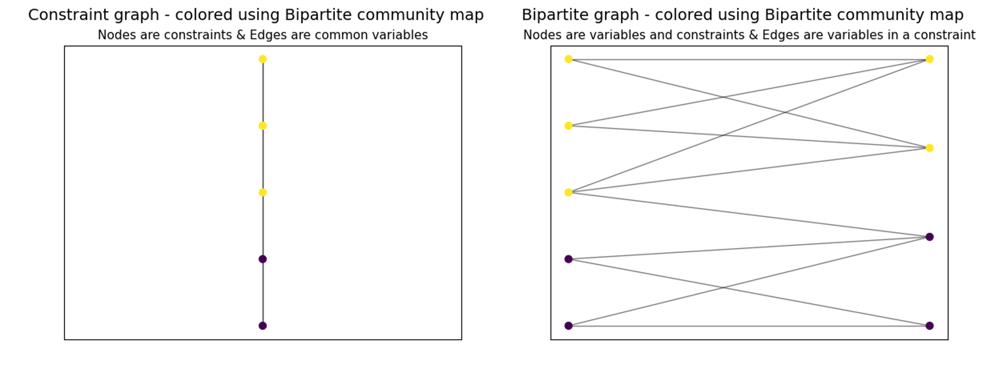
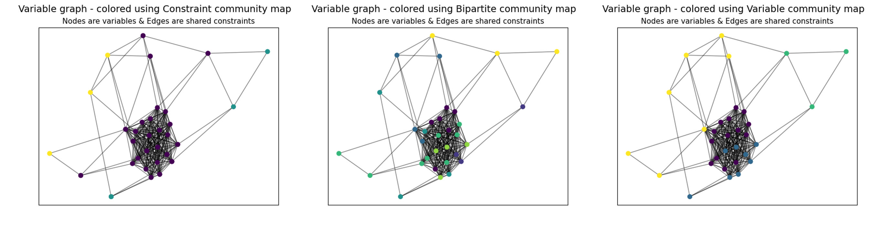

Community Detection for Pyomo models
====================================

This package separates model components (variables, constraints, and objectives) into different communities
distinguished by the degree of connectivity between community members.

Description of Package and Main Function ``detect_communities``
---------------------------------------------------------------

The community detection package allows users to obtain a community map of a Pyomo model - a Python dictionary-like
object that maps sequential integer values to communities within the Pyomo model. The package
takes in a model, organizes the model components into a graph of nodes and edges, then uses Louvain
community detection (`Blondel et al, 2008`_) to determine the communities that exist within the model.

.. _Blondel et al, 2008: https://dx.doi.org/10.1088/1742-5468/2008/10/P10008

In graph theory, a community is defined as a subset of nodes that have a greater degree of connectivity within
themselves than they do with the rest of the nodes in the graph. In the context of Pyomo models, a community
represents a subproblem within the overall optimization problem. Identifying these subproblems and then solving them
independently can save computational work compared with trying to solve the entire model at once. Thus, it
can be very useful to know the communities that exist in a model.

The manner in which the graph of nodes and edges is constructed from the model directly affects the community
detection. Thus, this package provides the user with a lot of control over the construction of the graph. The
function we use for this community detection is shown below:

.. autofunction:: pyomo.contrib.community_detection.detection.detect_communities

As stated above, the characteristics of the NetworkX graph of the Pyomo model are very important to the
community detection. The main graph features the user can specify are the type of community map,
whether the graph is weighted or unweighted, and whether the objective function(s) is included
in the graph generation. Below, the significance and reasoning behind including each of these options are
explained in greater depth.

Type of Community Map (``type_of_community_map``)
    In this package's main function (``detect_communities``), the user can select ``'bipartite'``, ``'constraint'``,
    or ``'variable'`` as an input for the 'type_of_community_map' argument, and these result in a community map
    based on a bipartite graph, a constraint node graph, or a variable node graph (respectively).

    If the user sets ``type_of_community_map='constraint'``, then each entry in the community map (which is a dictionary) contains
    a list of all the constraints in the community as well as all the variables contained in those constraints.
    For the model graph, a node is created for every active constraint in the model, an edge between two
    constraint nodes is created only if those two constraint equations share a variable, and the
    weight of each edge is equal to the number of variables the two constraint equations have in common.

    If the user sets ``type_of_community_map='variable'``, then each entry in the community map (which is a dictionary) contains
    a list of all the variables in the community as well as all the constraints that contain those variables.
    For the model graph, a node is created for every variable in the model, an edge between two variable nodes is
    created only if those two variables occur in the same constraint equation, and the weight of each edge is equal
    to the number of constraint equations in which the two variables occur together.

    If the user sets ``type_of_community_map='bipartite'``, then each entry in the community map (which is a dictionary) is
    simply all of the nodes in the community but split into a list of constraints and a list of variables.
    For the model graph, a node is created for every variable and every constraint in the model. An edge is created
    between a constraint node and a variable node only if the constraint equation contains the variable. (Edges are
    not drawn between nodes of the same type in a bipartite graph.) And as for the edge weights, the edges in the
    bipartite graph are unweighted regardless of what the user specifies for the ``weighted_graph`` parameter. (This is
    because for our purposes, the number of times a variable appears in a constraint is not particularly
    useful.)

Weighted Graph/Unweighted Graph (``weighted_graph``)
    The Louvain community detection algorithm takes edge weights into account, so depending on whether the graph is
    weighted or unweighted, the communities that are found will vary. This can be valuable depending on how
    the user intends to use the community detection information. For example, if a user plans on feeding that
    information into an algorithm, the algorithm may be better suited to the communities detected in a weighted
    graph (or vice versa).

With/Without Objective in the Graph (``with_objective``)
    This argument determines whether the objective function(s) will be included when creating the graphical
    representation of the model and thus whether the objective function(s) will be included in the community map.
    Some models have an objective function that contains so many of the model variables that it obscures potential
    communities within a model. Thus, it can be useful to call ``detect_communities(model, with_objective=False)``
    on such a model to see whether isolating the other components of the model provides any new insights.

External Packages
-----------------
* NetworkX
* Python-Louvain

The community detection package relies on two external packages, the NetworkX package and the Louvain community
detection package. Both of these packages can be installed at the following URLs (respectively):

https://pypi.org/project/networkx/

https://pypi.org/project/python-louvain/

The pip install and conda install commands are included below as well::

    pip install networkx
    pip install python-louvain
    conda install -c anaconda networkx
    conda install -c conda-forge python-louvain

Usage Examples
--------------

Let's start off by taking a look at how we can use ''detect_communities'' and ''stringify_community_map''. We'll first
use a model from `Allman et al, 2019`_ :

.. _Allman et al, 2019: https://doi.org/10.1007/s11081-019-09450-5

.. doctest::

    Required Imports
    >>> from pyomo.contrib.community_detection.detection import detect_communities, visualize_model_graph, \
    >>>     stringify_community_map, generate_model_graph
    >>> from pyomo.contrib.mindtpy.tests.eight_process_problem import EightProcessFlowsheet
    >>> from pyomo.core import ConcreteModel, Var, Constraint
    >>> import matplotlib.pyplot as plt
    >>> import networkx as nx
    >>> import copy

    Let's define a model for our use
    >>> def decode_model_1():
    ...     model = m = ConcreteModel()
    ...     m.x1 = Var(initialize=-3)
    ...     m.x2 = Var(initialize=-1)
    ...     m.x3 = Var(initialize=-3)
    ...     m.x4 = Var(initialize=-1)
    ...     m.c1 = Constraint(expr=m.x1 + m.x2 <= 0)
    ...     m.c2 = Constraint(expr=m.x1 - 3 * m.x2 <= 0)
    ...     m.c3 = Constraint(expr=m.x2 + m.x3 + 4 * m.x4 ** 2 == 0)
    ...     m.c4 = Constraint(expr=m.x3 + m.x4 <= 0)
    ...     m.c5 = Constraint(expr=m.x3 ** 2 + m.x4 ** 2 - 10 == 0)
    ...     return model
    >>> model = m = decode_model_1()
    >>> seed = 5  # To be used as a random seed value for the heuristic Louvain community detection

    Let's create an instance of the CommunityMap class (which is what gets returned by the
    function detect_communities):
    >>> community_map_object = detect_communities(model, type_of_community_map='bipartite', random_seed=seed)

    This community map object has many attributes that contain the relevant information about the
    community map itself (such as the parameters used to create it, the networkX representation, and other useful
    information).

    An important point to note is that the community_map attribute of the CommunityMap class is the
    actual dictionary that maps integers to the communities within the model. It is expected that the user will be
    most interested in the actual dictionary itself, so dict-like usage is permitted.

    Lastly, if a user wishes to modify the actual dictionary (the community_map attribute of the CommunityMap object),
    creating a deep copy is highly recommended (or else any destructive modifications could have
    unintended consequences):
    >>> community_map_to_modify = copy.deepcopy(community_map_object.community_map)

    Now, let's print the bipartite community map generated by 'detect_communities' and take a look at the output
    >>> print(detect_communities(model, type_of_community_map='bipartite'))
    {0: (['c1', 'c2'], ['x1', 'x2']),
     1: (['c3', 'c4', 'c5'], ['x3', 'x4'])}

    Printing a community map object is made to be user-friendly (by showing the community map with components
    replaced by their strings). However, if the default Pyomo representation of components is desired, then the
    community_map attribute or the repr() function can be used:
    >>> print(community_map_object.community_map)  # or print(repr(community_map_object))
    {0: ([<pyomo.core.base.constraint.SimpleConstraint object at 0x0000028DA74BB588>,
          <pyomo.core.base.constraint.SimpleConstraint object at 0x0000028DA74BB5F8>],
         [<pyomo.core.base.var.SimpleVar object at 0x0000028DA74BB3C8>,
          <pyomo.core.base.var.SimpleVar object at 0x0000028DA74BB438>]),
     1: ([<pyomo.core.base.constraint.SimpleConstraint object at 0x0000028DA74BB668>,
          <pyomo.core.base.constraint.SimpleConstraint object at 0x0000028DA74BB6D8>,
          <pyomo.core.base.constraint.SimpleConstraint object at 0x0000028DA74BB748>],
         [<pyomo.core.base.var.SimpleVar object at 0x0000028DA74BB4A8>,
          <pyomo.core.base.var.SimpleVar object at 0x0000028DA74BB518>])}

If we want a visualization of the communities within the Pyomo model, we can use ``visualize_model_graph`` to do
so. Let's take a look at how this can be done in the following example:

.. doctest::

    Create a CommunityMap object (so we can demonstrate the visualize_model_graph method)
    >>> community_map_object = cmo = detect_communities(model, type_of_community_map='bipartite', random_seed=seed)

    Obtain a matplotlib figure (left_figure) and the graph layout (pos)
    >>> left_figure, pos = cmo.visualize_model_graph(type_of_graph='bipartite')
    Calling 'plt.show()' displays the figure (shown below as the figure on the left)
    >>> plt.show()

    Note that the pos argument returned above is used in the following function call,
    which can be used to ensure identical graph layouts

    >>> right_figure, _ = cmo.visualize_model_graph(type_of_graph='variable', pos=pos)
    >>> plt.show()

    An example of the two separate graphs created for these two function calls is shown below:

These graph drawings very clearly demonstrate the communities within this model. We can see how there is only one edge
between the two communities and many more edges within each community. This is an ideal situation for breaking a
model into separate communities since there is little connectivity between the communities. Also, note that we can
choose different graph types (such as a variable node graph, constraint node graph, or bipartite graph).

Let's try a more complicated model, taken from `Duran & Grossmann, 1986`_:

.. _Duran & Grossmann, 1986: https://dx.doi.org/10.1007/BF02592064

.. doctest::

    Define the model
    >>> model = EightProcessFlowsheet()

    Now, we follow the same steps as we did in the example above (see above for explanations)
    >>> community_map_object = cmo = detect_communities(model, type_of_community_map='constraint', random_seed=seed)
    >>> left_fig, pos = cmo.visualize_model_graph(type_of_graph='variable')
    >>> plt.show()

    As we did before, we will use the returned 'pos' to create a consistent graph layout
    >>> community_map_object = cmo = detect_communities(model, type_of_community_map='bipartite')
    >>> middle_fig, _ = cmo.visualize_model_graph(type_of_graph='variable', pos=pos)
    >>> plt.show()

    >>> community_map_object = cmo = detect_communities(model, type_of_community_map='variable')
    >>> right_fig, _ = cmo.visualize_model_graph(type_of_graph='variable', pos=pos)
    >>> plt.show()

    We can see an example for the three separate graphs created by these three function calls
    (drawn with 'plt.show()') below:

The three graphs above are all variable graphs - which means the nodes represent variables in the model, and the edges
represent constraint equations. The coloring differs because the three graphs rely on community maps that were
created based on a constraint node graph, a bipartite graph, and a variable node graph (from left to right). For
example, the community map that was generated from a constraint node graph (``type_of_community_map='constraint'``)
resulted in three communities (as seen by the purple, yellow, and blue nodes).

For our final example, we will use ``generate_model_graph`` - this function can be used to create a NetworkX
graph for a Pyomo model. Here, we will create a NetworkX graph from the model in our first example and
then create the edge and adjacency list for the graph.

``generate_model_graph`` returns three things:

* a NetworkX graph of the given model
* a dictionary that maps the numbers used to represent the model components to
  the actual components (because Pyomo components cannot be directly added to a NetworkX graph)
* a dictionary that maps constraints to the variables in them.

For this example, we will only need the NetworkX graph of the model and the number-to-component mapping.

.. doctest::

    Define the model
    >>> model = decode_model_1()

    See above for the description of the items returned by 'generate_model_graph'
    >>> model_graph, number_component_map, constr_var_map = generate_model_graph(model, type_of_graph='constraint')

    The next two lines create and implement a mapping to change the node values from numbers into
    strings. The second line uses this mapping to create string_model_graph, which has the relabeled nodes.
    >>> string_map = dict((number, str(comp)) for number, comp in number_component_map.items())
    >>> string_model_graph = nx.relabel_nodes(model_graph, string_map)

    Now, we print the edge list and the adjacency list:
    >>> print('Edge List:')
    >>> for line in nx.generate_edgelist(string_model_graph):
    >>>     print(line)

    >>> print('Adjacency List:')
    >>> for line in nx.generate_adjlist(string_model_graph):
    >>>     print(line)
    Edge List:
    c1 c2 {'weight': 2}
    c1 c3 {'weight': 1}
    c2 c3 {'weight': 1}
    c3 c4 {'weight': 2}
    c3 c5 {'weight': 2}
    c4 c5 {'weight': 2}
    Adjacency List:
    c1 c2 c3
    c2 c3
    c3 c4 c5
    c4 c5
    c5

It's worth mentioning that in the code above, we do not have to create ``string_map`` to create an edge list
or adjacency list, but for the sake of having an easily understandable output, it is quite helpful. (Without
relabeling the nodes, the output below would not have the strings of the components but instead would have
integer values.) This code will hopefully make it easier for a user to do the same.

Functions in this Package
-------------------------
.. automodule:: pyomo.contrib.community_detection.detection
    :members:

.. automodule:: pyomo.contrib.community_detection.community_graph
    :members:
