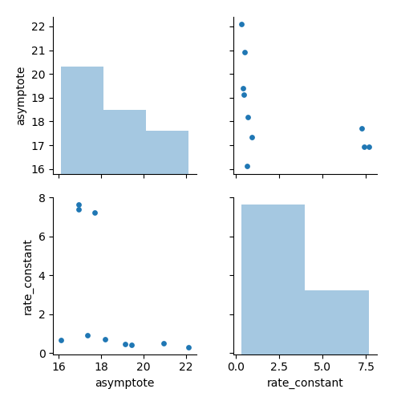
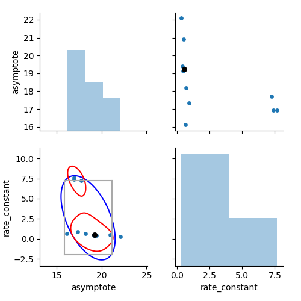
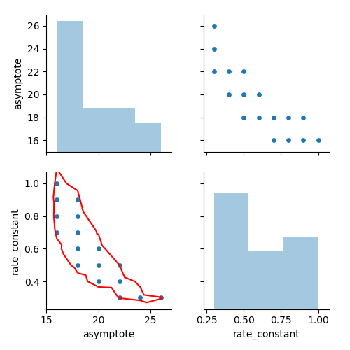

.. _graphicssection:

Graphics
========

parmest includes several functions to visualize results, including:

#. :class:`~pyomo.contrib.parmest.graphics.pairwise_plot`: 
   A pairwise plot which includes a histogram of each parameter along the diagonal and 
   a scatter plot for each pair of parameters in the upper and lower sections.  Optionally, 
   parameter estimates for theta can be supplied and are displayed as a black point in each scatter plot.
#. :class:`~pyomo.contrib.parmest.graphics.pairwise_bootstrap_plot`: 
   A pairwise plot which includes a histogram of each parameter along the diagonal,   
   a scatter plot for each pair of parameters in the upper section, and
   rectangular (gray), multivariate normal (blue), and Gaussian kernel density estimation (red) 
   confidence regions in the lower section. 
   This function returns the multivariate normal and Gaussian kernel density estimation distributions 
   which can be used to generate scenarios.
#. :class:`~pyomo.contrib.parmest.graphics.pairwise_likelihood_ratio_plot`: 
   A pairwise plot which includes a histogram of each parameter along the diagonal,   
   a scatter plot for each pair of parameters in the upper section, and
   confidence region (red) using a chi-squared test in the lower section.
   This function returns a DataFrame with points inside the region.

For each function, axis limits can be supplied along with a file name used to save the figure.
The following examples were generated using the Rooney Biegler example.

.. _fig-pairwise1:

   Pairwise plot. 
   
.. _fig-pairwise2:

   Pairwise bootstrap plot.  Rectangular (gray), multivariate normal (blue) 
   and Gaussian kernel density estimation (red) confidence regions are shown on the lower section.
   
.. _fig-pairwise3:

   Pairwise likelihood ratio plot. Confidence region (red) using a chi-squared test shown in the lower section.
