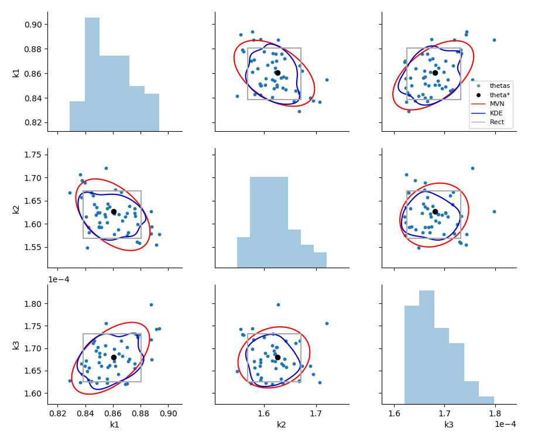
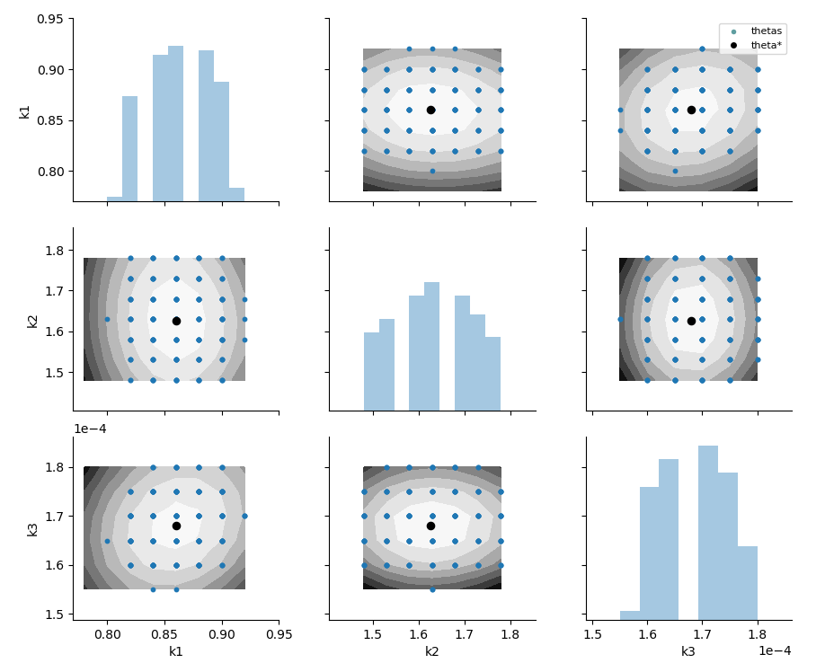

.. _graphicssection:

Graphics
========================

parmest includes a function, :class:`~pyomo.contrib.parmest.parmest.pairwise_plot`, 
to visualize results from bootstrap and likelihood ratio analysis.
Confidence intervals using rectangular, multivariate normal, and kernel density 
estimate distributions can be included in the plot and used for scenario creation. 
Examples are provided in the :ref:`examplesection` Section.

The pairwise plot includes a histogram of each parameter along the diagonal and 
a scatter plot for each pair of parameters in the upper and lower sections.  
The pairwise plot can also include the following optional information:

* A single value for each theta (generally theta* from parameter estimation).
* Confidence intervals for rectangular, multivariate normal, and/or kernel density 
  estimate distributions at a specified level (i.e. 0.8).
  For plots with more than 2 parameters, theta* is used to extract a slice of the confidence 
  region for each pairwise plot.
* Filled contour lines for objective values at a specified level (i.e. 0.8).
  For plots with more than 2 parameters, theta* is used to extract a slice of the contour lines for each pairwise plot.
* In addition to creating a figure, the user can optionally return the confidence region distributions 
  which can be used to generate scenarios.

The following examples were generated using the reactor design example.
:ref:fig-pairwise1 uses output from the bootstrap analysis, and 
:ref:fig-pairwise2 uses output from the likelihood ratio test.

.. _fig-pairwise1:

   Pairwise bootstrap plot with rectangular, multivariate normal
   and kernel density estimation confidence region.
   
.. _fig-pairwise2:

   Pairwise likelihood ratio plot with contours of the objective and points that lie within an alpha confidence region.
   