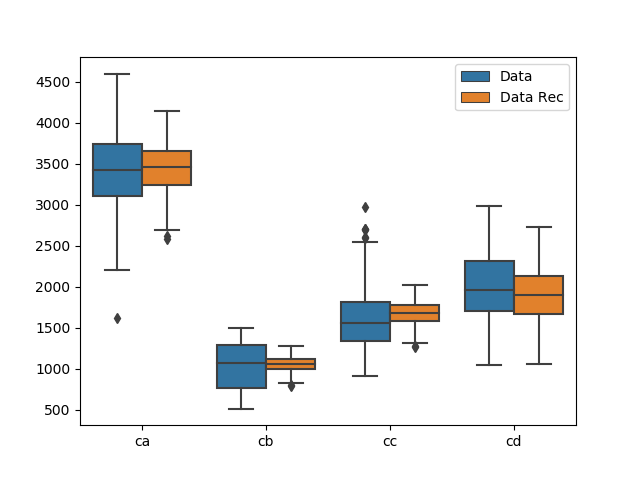

.. _graphicssection:

Graphics
========

parmest includes the following functions to help visualize results:

* :class:`~pyomo.contrib.parmest.graphics.grouped_boxplot`
* :class:`~pyomo.contrib.parmest.graphics.grouped_violinplot`
* :class:`~pyomo.contrib.parmest.graphics.pairwise_plot`
   
Grouped boxplots and violinplots are used to compare datasets, generally
before and after data reconciliation.  Pairwise plots are used to
visualize results from parameter estimation and include a histogram of
each parameter along the diagonal and a scatter plot for each pair of
parameters in the upper and lower sections.  The pairwise plot can also
include the following optional information:

* A single value for each theta (generally theta* from parameter
  estimation).
* Confidence intervals for rectangular, multivariate normal, and/or
  Gaussian kernel density estimate distributions at a specified level
  (i.e. 0.8).  For plots with more than 2 parameters, theta* is used to
  extract a slice of the confidence region for each pairwise plot.
* Filled contour lines for objective values at a specified level
  (i.e. 0.8).  For plots with more than 2 parameters, theta* is used to
  extract a slice of the contour lines for each pairwise plot.

The following examples were generated using the reactor design example.
:numref:`fig-boxplot` uses output from data reconciliation, 
:numref:`fig-pairwise1` uses output from the bootstrap analysis, and
:numref:`fig-pairwise2` uses output from the likelihood ratio test.

.. _fig-boxplot:

   Grouped boxplot showing data before and after data reconciliation.
   
.. _fig-pairwise1:

   Pairwise bootstrap plot with rectangular, multivariate normal and
   kernel density estimation confidence region.
   
.. _fig-pairwise2:

   Pairwise likelihood ratio plot with contours of the objective and
   points that lie within an alpha confidence region.
