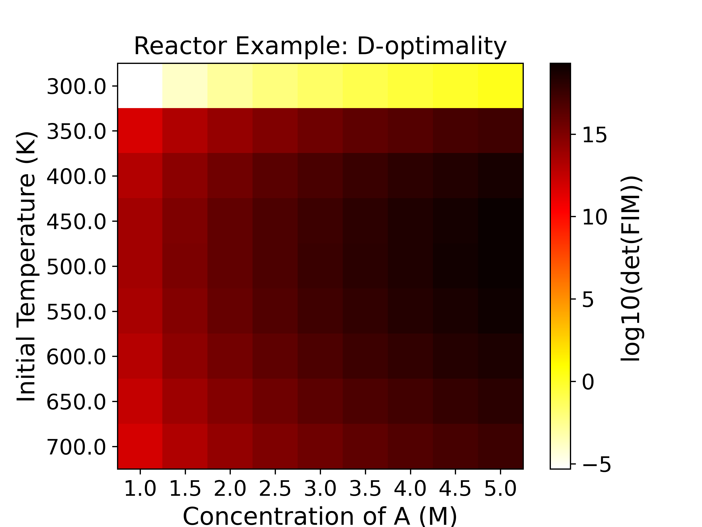
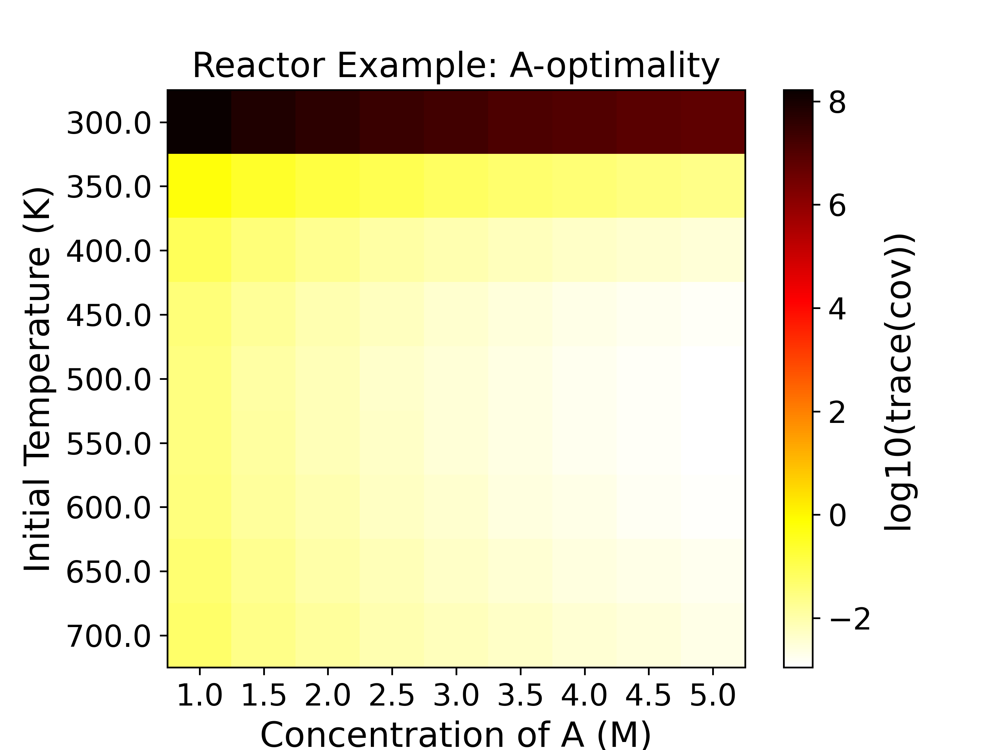
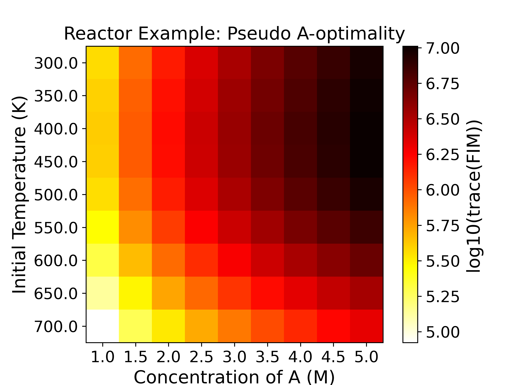
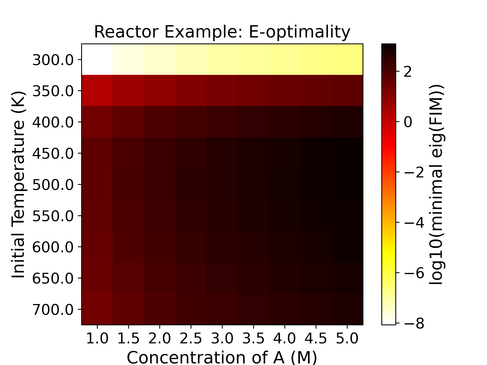

.. _pyomo.doe:

Pyomo.DoE
=========
**Pyomo.DoE** (Pyomo Design of Experiments) is a Python library for model-based design 
of experiments using science-based models.

Pyomo.DoE was originally created by **Jialu Wang** and **Alexander W. Dowling** at the 
University of Notre Dame as part of the `Carbon Capture Simulation for Industry Impact 
(CCSI2) <https://github.com/CCSI-Toolset/>`_
project, funded through the U.S. Department Of Energy Office of Fossil Energy with 
assistance from **John Siirola**, **Bethany Nicholson**, **Miranda Mundt**,and **Hailey Lynch**.
Significant improvements and extensions were contributed by **Dan Laky**, and 
**Shuvashish Mondal** with funding from the 
`Process Optimization & Modeling for Minerals Sustainability (PrOMMiS) <https://www.netl.doe.gov/prommis>`_ 
and the `University of Notre Dame <https://www.nd.edu/>`_.

If you use Pyomo.DoE, please cite:

[Wang and Dowling, 2022] Wang, Jialu, and Alexander W. Dowling.
"Pyomo.DOE: An open‐source package for model‐based design of experiments in Python."
AIChE Journal 68.12 (2022): e17813. `https://doi.org/10.1002/aic.17813`

Methodology Overview
---------------------

Model-based Design of Experiments (MBDoE) is a technique to maximize the information 
gain from experiments by directly using science-based models with physically meaningful 
parameters. It is one key component in the model calibration and uncertainty 
quantification workflow shown below:

.. figure:: pyomo_doe_workflow.png
   :align: center
   :scale: 25 %

   The parameter estimation, uncertainty analysis, and MBDoE are 
   combined into an iterative framework to select, refine, and calibrate science-based 
   mathematical models with quantified uncertainty. Currently, Pyomo.DoE focuses on 
   increasing parameter precision.

Pyomo.DoE provides the exploratory analysis and MBDoE capabilities to the 
Pyomo ecosystem. The user provides one Pyomo model, a set of parameter nominal values,
the allowable design spaces for design variables, and the assumed observation error model.
During exploratory analysis, Pyomo.DoE checks if the model parameters can be 
inferred from the postulated measurements or preliminary data.
MBDoE then recommends optimized experimental conditions for collecting more data.
Parameter estimation packages such as :ref:`Parmest <parmest>` can perform 
parameter estimation using the available data to infer values for parameters,
and facilitate an uncertainty analysis to approximate the parameter covariance matrix.
If the parameter uncertainties are sufficiently small, the workflow terminates 
and returns the final model with quantified parametric uncertainty.
If not, MBDoE recommends optimized experimental conditions to generate new data 
that will maximize information gain and eventually reduce parameter uncertainty.

Below is an overview of the type of optimization models Pyomo.DoE can accommodate:

* Pyomo.DoE is suitable for optimization models of **continuous** variables
* Pyomo.DoE can handle **equality constraints** defining state variables
* Pyomo.DoE supports (Partial) Differential-Algebraic Equations (PDAE) models via :ref:`Pyomo.DAE <pyomo.dae>`
* Pyomo.DoE also supports models with only algebraic equations

The general form of a DAE problem that can be passed into Pyomo.DoE is shown below:

.. math::
   :nowrap:

   \[\begin{array}{l}
     \dot{\mathbf{x}}(t) = \mathbf{f}(\mathbf{x}(t), \mathbf{z}(t), \mathbf{y}(t), \mathbf{u}(t), \overline{\mathbf{w}}, \boldsymbol{\theta}) \\
     \mathbf{g}(\mathbf{x}(t),  \mathbf{z}(t), \mathbf{y}(t), \mathbf{u}(t), \overline{\mathbf{w}},\boldsymbol{\theta})=\mathbf{0} \\
     \mathbf{y} =\mathbf{h}(\mathbf{x}(t), \mathbf{z}(t), \mathbf{u}(t), \overline{\mathbf{w}},\boldsymbol{\theta}) \\
     \mathbf{f}^{\mathbf{0}}\left(\dot{\mathbf{x}}\left(t_{0}\right), \mathbf{x}\left(t_{0}\right), \mathbf{z}(t_0), \mathbf{y}(t_0), \mathbf{u}\left(t_{0}\right), \overline{\mathbf{w}}, \boldsymbol{\theta}\right)=\mathbf{0} \\
     \mathbf{g}^{\mathbf{0}}\left( \mathbf{x}\left(t_{0}\right),\mathbf{z}(t_0), \mathbf{y}(t_0), \mathbf{u}\left(t_{0}\right), \overline{\mathbf{w}}, \boldsymbol{\theta}\right)=\mathbf{0}\\
     \mathbf{y}^{\mathbf{0}}\left(t_{0}\right)=\mathbf{h}\left(\mathbf{x}\left(t_{0}\right),\mathbf{z}(t_0), \mathbf{u}\left(t_{0}\right), \overline{\mathbf{w}}, \boldsymbol{\theta}\right)
   \end{array}\]

where:

*  :math:`\boldsymbol{\theta} \in \mathbb{R}^{N_p}` are unknown model parameters.
*  :math:`\mathbf{x} \subseteq \mathcal{X}` are dynamic state variables which characterize trajectory of the system, :math:`\mathcal{X} \in \mathbb{R}^{N_x \times N_t}`.
*  :math:`\mathbf{z} \subseteq \mathcal{Z}` are algebraic state variables, :math:`\mathcal{Z} \in \mathbb{R}^{N_z \times N_t}`.
*  :math:`\mathbf{u} \subseteq \mathcal{U}` are time-varying decision variables,  :math:`\mathcal{U} \in \mathbb{R}^{N_u \times N_t}`.
*  :math:`\overline{\mathbf{w}} \in \mathbb{R}^{N_w}` are time-invariant decision variables.
*  :math:`\mathbf{y} \subseteq \mathcal{Y}` are measurement response variables,   :math:`\mathcal{Y} \in \mathbb{R}^{N_r \times N_t}`.
*  :math:`\mathbf{f}(\cdot)` are differential equations.
*  :math:`\mathbf{g}(\cdot)` are algebraic equations.
*  :math:`\mathbf{h}(\cdot)` are measurement functions.
*  :math:`\mathbf{t} \in \mathbb{R}^{N_t \times 1}` is a union of all time sets.

.. note::
    * Parameters and design variables should be defined as Pyomo ``Var`` components 
      when building the model using the ``Experiment`` class so that users can use both 
      ``Parmest`` and ``Pyomo.DoE`` seamlessly.

Based on the above notation, the form of the MBDoE problem addressed in Pyomo.DoE is shown below:

.. math::
   :nowrap:

    \begin{equation}
    \begin{aligned}
        \underset{\boldsymbol{\varphi}}{\max} \quad & \Psi (\mathbf{M}(\boldsymbol{\hat{\theta}}, \boldsymbol{\varphi})) \\
        \text{s.t.} \quad & \mathbf{M}(\boldsymbol{\hat{\theta}}, \boldsymbol{\varphi}) = \sum_r^{N_r} \sum_{r'}^{N_r} \tilde{\sigma}_{(r,r')}\mathbf{Q}_r^\mathbf{T} \mathbf{Q}_{r'} + \mathbf{V}_{\boldsymbol{\theta}}(\boldsymbol{\hat{\theta}})^{-1} \\
        & \dot{\mathbf{x}}(t) = \mathbf{f}(\mathbf{x}(t), \mathbf{z}(t), \mathbf{y}(t), \mathbf{u}(t), \overline{\mathbf{w}}, \boldsymbol{\hat{\theta}}) \\
        & \mathbf{g}(\mathbf{x}(t),  \mathbf{z}(t), \mathbf{y}(t), \mathbf{u}(t), \overline{\mathbf{w}},\boldsymbol{\hat{\theta}})=\mathbf{0} \\
        & \mathbf{y} =\mathbf{h}(\mathbf{x}(t), \mathbf{z}(t), \mathbf{u}(t), \overline{\mathbf{w}},\boldsymbol{\hat{\theta}}) \\
        & \mathbf{f}^{\mathbf{0}}\left(\dot{\mathbf{x}}\left(t_{0}\right), \mathbf{x}\left(t_{0}\right), \mathbf{z}(t_0), \mathbf{y}(t_0), \mathbf{u}\left(t_{0}\right), \overline{\mathbf{w}}, \boldsymbol{\hat{\theta}})\right)=\mathbf{0} \\
        & \mathbf{g}^{\mathbf{0}}\left( \mathbf{x}\left(t_{0}\right),\mathbf{z}(t_0), \mathbf{y}(t_0), \mathbf{u}\left(t_{0}\right), \overline{\mathbf{w}}, \boldsymbol{\hat{\theta}}\right)=\mathbf{0}\\
        &\mathbf{y}^{\mathbf{0}}\left(t_{0}\right)=\mathbf{h}\left(\mathbf{x}\left(t_{0}\right),\mathbf{z}(t_0), \mathbf{u}\left(t_{0}\right), \overline{\mathbf{w}}, \boldsymbol{\hat{\theta}}\right)
    \end{aligned}
    \end{equation}

where:

*  :math:`\boldsymbol{\varphi}` are design variables, which are manipulated to maximize the information content of experiments. It should consist of one or more of  :math:`\mathbf{u}(t), \mathbf{y}^{\mathbf{0}}({t_0}),\overline{\mathbf{w}}`. With a proper model formulation, the timepoints for control or measurements :math:`\mathbf{t}` can also be degrees of freedom.
*  :math:`\mathbf{M}` is the Fisher information matrix (FIM), estimated as the inverse of the covariance matrix of parameter estimates  :math:`\boldsymbol{\hat{\theta}}`. A large FIM indicates more information contained in the experiment for parameter estimation.
*  :math:`\mathbf{Q}` is the dynamic sensitivity matrix, containing the partial derivatives of  :math:`\mathbf{y}` with respect to  :math:`\boldsymbol{\theta}`.
*  :math:`\Psi` is the scalar design criteria to measure the information content in FIM.
*  :math:`\mathbf{V}_{\boldsymbol{\theta}}(\boldsymbol{\hat{\theta}})^{-1}` is the FIM of previous experiments.

Pyomo.DoE provides five design criteria  :math:`\Psi` to measure the information in FIM:

.. list-table:: Pyomo.DoE design criteria
    :header-rows: 1
    :class: tight-table

    * - Design criterion
      - Computation
      - Geometrical meaning
    * - A-optimality
      -   :math:`\text{trace}({\mathbf{M}}^{-1})`
      - Dimensions of the enclosing box of the confidence ellipse
    * - Pseudo A-optimality
      -   :math:`\text{trace}({\mathbf{M}})`
      - Dimensions of the enclosing box of the inverse of the confidence ellipse
    * - D-optimality
      -   :math:`\text{det}({\mathbf{M}})`
      - Volume of the confidence ellipse
    * - E-optimality
      -   :math:`\text{min eig}({\mathbf{M}})`
      - Size of the longest axis of the confidence ellipse
    * - Modified E-optimality
      -   :math:`\text{cond}({\mathbf{M}})`
      - Ratio of the longest axis to the shortest axis of the confidence ellipse

In order to solve problems of the above, Pyomo.DoE implements the 2-stage stochastic program. Please see Wang and Dowling (2022) for details.

Pyomo.DoE Required Inputs
--------------------------------
The required input to the Pyomo.DoE is a subclass of the :ref:`Parmest <parmest>` ``Experiment`` class. 
The subclass must have a ``get_labeled_model`` method which returns a Pyomo `ConcreteModel` 
containing four Pyomo ``Suffix`` components identifying the parts of the model used in 
MBDoE analysis. This is in line with the convention used in the parameter estimation tool, 
:ref:`Parmest <parmest>`. The four Pyomo ``Suffix`` components are:

* ``experiment_inputs`` - The experimental design decisions
* ``experiment_outputs`` - The values measured during the experiment
* ``measurement_error`` - The error associated with individual values measured during the experiment. It is passed as a standard deviation or square root of the diagonal elements of the observation error covariance matrix. Pyomo.DoE currently assumes that the observation errors are Gaussain and independent both in time and across measurements.
* ``unknown_parameters`` - Those parameters in the model that are estimated using the measured values during the experiment

An example of the subclassed ``Experiment`` object that builds and labels the model is shown in the next few sections.

Pyomo.DoE Usage Example
-----------------------

We illustrate the use of Pyomo.DoE using a reaction kinetics example (Wang and Dowling, 2022). 

.. math::
   :nowrap:

   \begin{equation}
       A \xrightarrow{k_1} B \xrightarrow{k_2} C
   \end{equation}

The Arrhenius equations model the temperature dependence of the reaction rate coefficient  :math:`k_1, k_2`. Assuming a first-order reaction mechanism gives the reaction rate model. Further, we assume only species A is fed to the reactor.

.. math::
   :nowrap:

    \begin{equation}
    \begin{aligned}
        k_1 & = A_1 e^{-\frac{E_1}{RT}} \\
        k_2 & = A_2 e^{-\frac{E_2}{RT}} \\
        \frac{d{C_A}}{dt} & = -k_1{C_A}  \\
        \frac{d{C_B}}{dt} &  = k_1{C_A} - k_2{C_B}  \\
        C_{A0}& = C_A + C_B + C_C \\
        C_B(t_0) & = 0 \\
        C_C(t_0) & = 0 \\
    \end{aligned}
    \end{equation}

:math:`C_A(t), C_B(t), C_C(t)` are the time-varying concentrations of the species A, B, C, respectively.
:math:`k_1, k_2` are the rate constants for the two chemical reactions using an Arrhenius equation with activation energies :math:`E_1, E_2` and pre-exponential factors :math:`A_1, A_2`.
The goal of MBDoE is to optimize the experiment design variables :math:`\boldsymbol{\varphi} = (C_{A0}, T(t))`, where :math:`C_{A0},T(t)` are the initial concentration of species A and the time-varying reactor temperature, to maximize the precision of unknown model parameters :math:`\boldsymbol{\theta} = (A_1, E_1, A_2, E_2)` by measuring :math:`\mathbf{y}(t)=(C_A(t), C_B(t), C_C(t))`.
The observation errors are assumed to be independent both in time and across measurements with a constant standard deviation of 1 M for each species.

Step 0: Import Pyomo and the Pyomo.DoE module and create an ``Experiment`` class
^^^^^^^^^^^^^^^^^^^^^^^^^^^^^^^^^^^^^^^^^^^^^^^^^^^^^^^^^^^^^^^^^^^^^^^^^^^^^^^^
.. note::

    This example uses the data file ``result.json``, located in the Pyomo repository at: 
    ``pyomo/contrib/doe/examples/result.json``, which contains the nominal parameter 
    values, and measurements for the reaction kinetics experiment.

.. doctest::

    # === Required import ===
    >>> import pyomo.environ as pyo
    >>> from pyomo.dae import ContinuousSet, DerivativeVar
    >>> from pyomo.contrib.doe import DesignOfExperiments
    >>> from pyomo.contrib.parmest.experiment import Experiment
    >>> import pathlib
    >>> import numpy as np
    >>> import json

Subclass the :ref:`Parmest <parmest>` ``Experiment`` class to define the reaction 
kinetics experiment and build the Pyomo ConcreteModel.
    
.. literalinclude:: /../../pyomo/contrib/doe/examples/reactor_experiment.py
    :start-after: ========================
    :end-before: End constructor definition

Step 1: Define the Pyomo process model
^^^^^^^^^^^^^^^^^^^^^^^^^^^^^^^^^^^^^^^

The process model for the reaction kinetics problem is shown below. Here, we build 
the model without any data or discretization.

.. literalinclude:: /../../pyomo/contrib/doe/examples/reactor_experiment.py
    :start-after: Create flexible model without data
    :end-before: End equation definition

Step 2: Finalize the Pyomo process model
^^^^^^^^^^^^^^^^^^^^^^^^^^^^^^^^^^^^^^^^^

Here, we add data to the model and finalize the discretization using a new method to 
the class. This step is required before the model can be labeled.

.. literalinclude:: /../../pyomo/contrib/doe/examples/reactor_experiment.py
    :start-after: End equation definition
    :end-before: End model finalization

Step 3: Label the information needed for DoE analysis
^^^^^^^^^^^^^^^^^^^^^^^^^^^^^^^^^^^^^^^^^^^^^^^^^^^^^

We label the four important groups as Pyomo Suffix components as mentioned before by 
adding a ``label_experiment`` method.

.. literalinclude:: /../../pyomo/contrib/doe/examples/reactor_experiment.py
    :start-after: End model finalization
    :end-before: End model labeling

Step 4: Implement the ``get_labeled_model`` method
^^^^^^^^^^^^^^^^^^^^^^^^^^^^^^^^^^^^^^^^^^^^^^^^^^

This method utilizes the previous 3 steps and is used by `Pyomo.DoE` to build the model 
to perform optimal experimental design.

.. literalinclude:: /../../pyomo/contrib/doe/examples/reactor_experiment.py
    :start-after: End constructor definition
    :end-before: Create flexible model without data

Step 5: Exploratory analysis (Enumeration)
^^^^^^^^^^^^^^^^^^^^^^^^^^^^^^^^^^^^^^^^^^^

After creating the subclass of the ``Experiment`` class, exploratory analysis is 
suggested to enumerate the design space to check if the problem is identifiable,
i.e., ensure that D-, E-optimality metrics are not small numbers near zero, and 
Modified E-optimality is not a big number. 
Additionally, it helps to initialize the model for the optimal experimental design step. 

Pyomo.DoE can perform exploratory sensitivity analysis with the ``compute_FIM_full_factorial`` method.
The ``compute_FIM_full_factorial`` method generates a grid over the design space as specified by the user. 
Each grid point represents an MBDoE problem solved using ``compute_FIM`` method. 
In this way, sensitivity of the FIM over the design space can be evaluated. 
Pyomo.DoE supports plotting the results from ``compute_FIM_full_factorial`` method 
with the ``draw_factorial_figure`` method.

The following code defines the ``run_reactor_doe`` function. This function encapsulates 
the workflow for both sensitivity analysis (Step 5) and optimal design (Step 6). 

.. literalinclude:: /../../pyomo/contrib/doe/examples/reactor_example.py
   :language: python
   :start-after: #  This software is distributed under the 3-clause BSD License.
   :end-before: if __name__ == "__main__":
   :linenos:

After defining the function, we will call it to perform the exploratory analysis and 
the optimal experimental design.

.. literalinclude:: /../../pyomo/contrib/doe/examples/reactor_example.py
    :language: python
    :start-after: if __name__ == "__main__":
    :dedent: 4

A design exploration for the initial concentration and temperature as experimental 
design variables with 9 values for each, produces the the five figures for 
five optimality criteria using  ``compute_FIM_full_factorial`` and 
``draw_factorial_figure`` methods as shown below: 

|plot1| |plot2|

|plot3| |plot4|

|plot5|

.. |plot5| image:: example_reactor_compute_FIM_ME_opt.png
   :width: 48 %

The heatmaps show the values of the objective functions, a.k.a. the 
experimental information content, in the design space. Horizontal 
and vertical axes are the two experimental design variables, while 
the color of each grid shows the experimental information content. 
For example, the D-optimality (upper left subplot) heatmap figure shows that the 
most informative region is around :math:`C_{A0}=5.0` M, :math:`T=500.0` K with 
a :math:`\log_{10}` determinant of FIM being around 19, 
while the least informative region is around :math:`C_{A0}=1.0` M, :math:`T=300.0` K, 
with a :math:`\log_{10}` determinant of FIM being around -5. For D-, Pseudo A-, and 
E-optimality we want to maximize the objective function, while for A- and Modified 
E-optimality we want to minimize the objective function.

Step 6: Performing an optimal experimental design
^^^^^^^^^^^^^^^^^^^^^^^^^^^^^^^^^^^^^^^^^^^^^^^^^^

In Step 5, we defined the ``run_reactor_doe`` function. This function constructs 
the DoE object and performs the exploratory sensitivity analysis. The way the function
is defined, it also proceeds immediately to the optimal experimental design step 
(applying ``run_doe`` on the ``DesignOfExperiments`` object). 
We can initialize the model with the result we obtained from the exploratory 
analysis (optimal point from the heatmaps) to help the optimal design step to speed 
up convergence. However, implementation of this initialization is not shown here.

After applying ``run_doe`` on the ``DesignOfExperiments`` object, 
the optimal design is an initial concentration of 5.0 mol/L and 
an initial temperature of 494 K with all other temperatures being 300 K. 
The corresponding :math:`\log_{10}` determinant of the FIM is 19.32.

