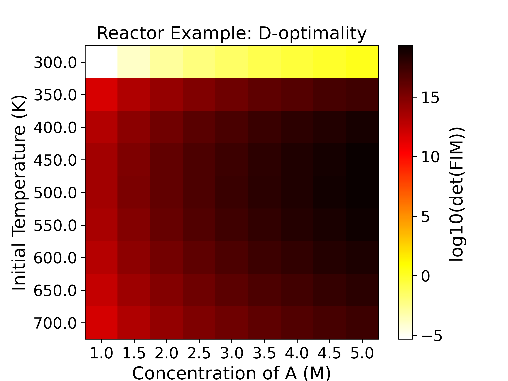
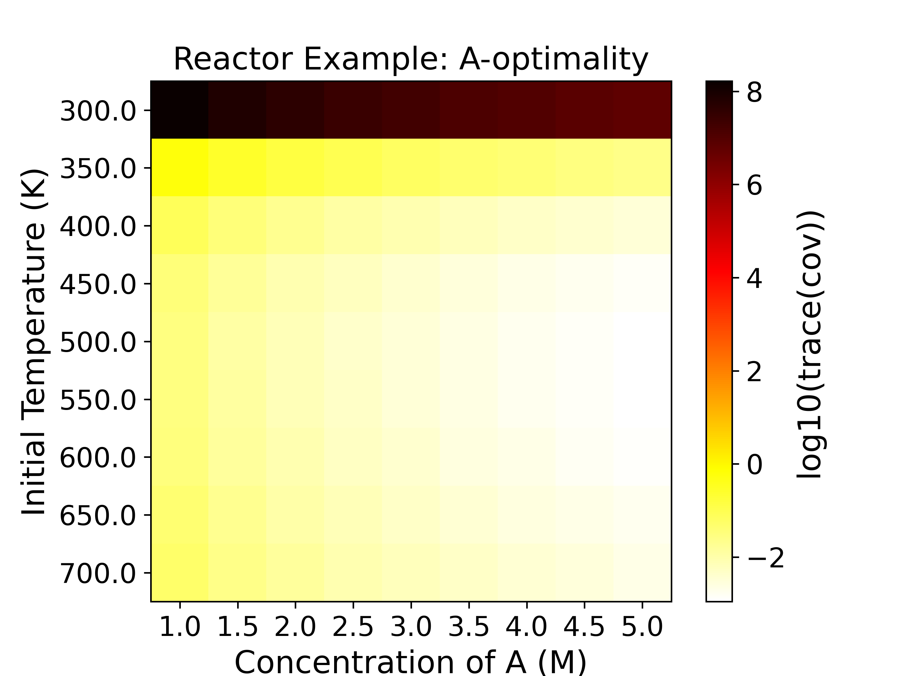
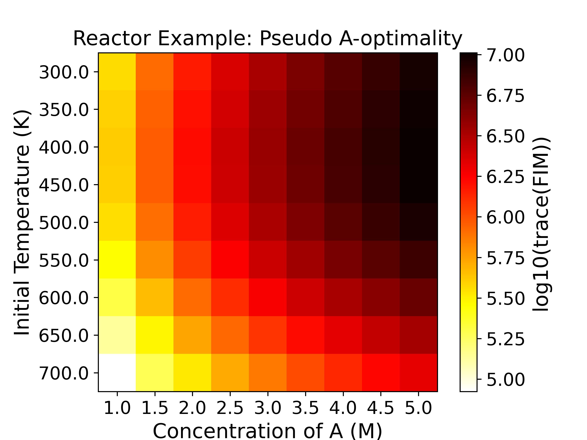
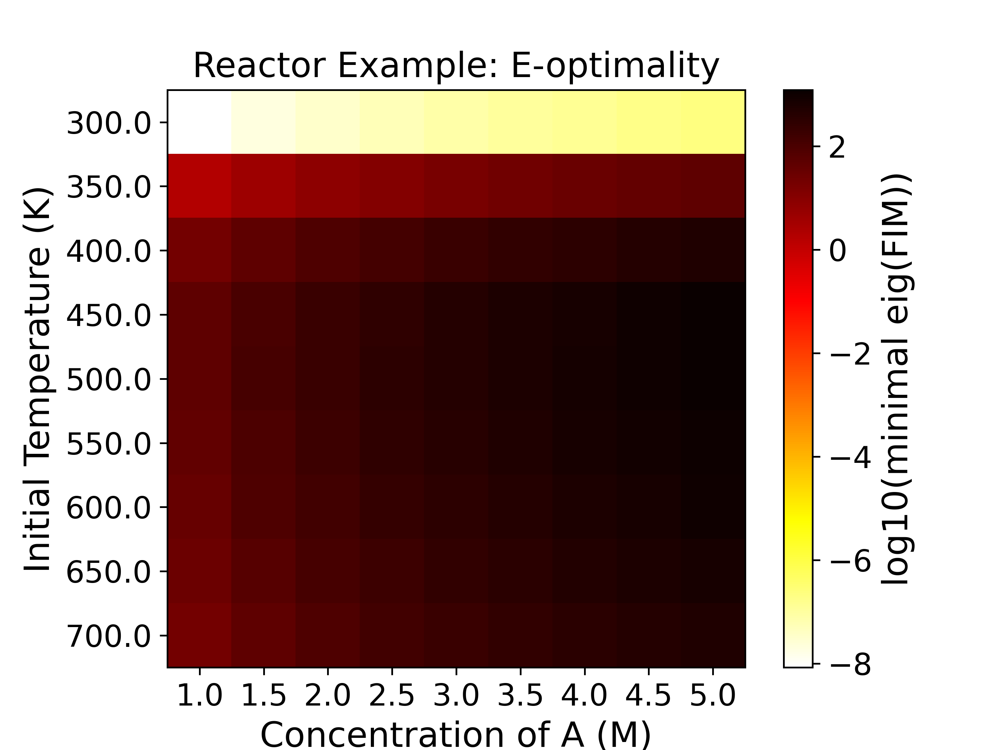
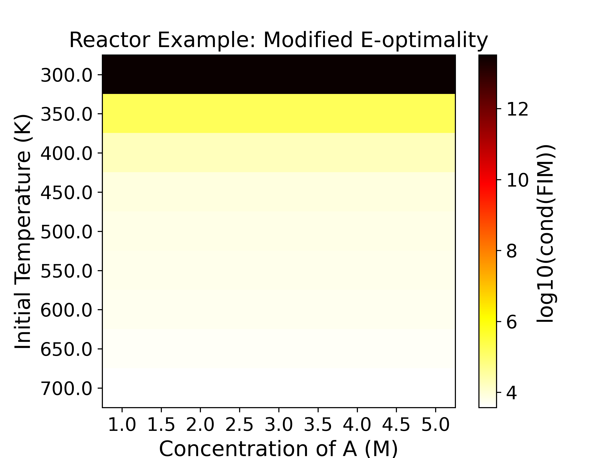

.. _doe_start_guide:

Quick Start Guide
=================

To use Pyomo.DoE, a user must implement a subclass of the :ref:`Parmest <parmest>` :class:`Experiment` class.
The subclass must have a ``get_labeled_model`` method which returns a Pyomo :class:`ConcreteModel`
containing four Pyomo :class:`Suffix` components identifying the parts of the model used in
MBDoE analysis. This is in line with the convention used in the parameter estimation tool,
:ref:`Parmest <parmest>`. The four Pyomo :class:`Suffix` components are:

* ``experiment_inputs`` - The experimental design decisions
* ``experiment_outputs`` - The variables that are being measured
* ``measurement_error`` - The error associated with the measured value of the experimental outputs. It is passed as a standard deviation or square root of the diagonal elements of the observation (measurement) error covariance matrix. Pyomo.DoE currently assumes that the observation errors are Gaussian and independent both in time and across measurements.
* ``unknown_parameters`` - Those parameters in the model that are estimated from the experimental outputs

An example of the subclassed :class:`Experiment` object that builds and labels the model is shown in the next few sections.

This guide illustrates the use of Pyomo.DoE using a reaction kinetics example ([WD22]_).

.. math::
   :nowrap:

   \begin{equation}
       A \xrightarrow{k_1} B \xrightarrow{k_2} C
   \end{equation}

The Arrhenius equations model the temperature dependence of the reaction rate coefficients  :math:`k_1` and :math:`k_2`. Assuming a first-order reaction mechanism gives the reaction rate model shown below. Further, we assume only species A is fed to the reactor.

.. math::
   :nowrap:

    \begin{equation}
    \begin{aligned}
        k_1 & = A_1 e^{-\frac{E_1}{RT}} \\
        k_2 & = A_2 e^{-\frac{E_2}{RT}} \\
        \frac{d{C_A}}{dt} & = -k_1{C_A}  \\
        \frac{d{C_B}}{dt} &  = k_1{C_A} - k_2{C_B}  \\
        C_{A0}& = C_A + C_B + C_C \\
        C_B(t_0) & = 0 \\
        C_C(t_0) & = 0 \\
    \end{aligned}
    \end{equation}

:math:`C_A(t), C_B(t), C_C(t)` are the time-varying concentrations of the species A, B, C, respectively.
:math:`k_1, k_2` are the rate constants for the two chemical reactions using an Arrhenius equation with activation energies :math:`E_1, E_2` and pre-exponential factors :math:`A_1, A_2`.
The goal of MBDoE is to optimize the experiment design variables :math:`\boldsymbol{\varphi} = (C_{A0}, T(t))`, where :math:`C_{A0},T(t)` are the initial concentration of species A and the time-varying reactor temperature, to maximize the precision of unknown model parameters :math:`\boldsymbol{\theta} = (A_1, E_1, A_2, E_2)` by measuring :math:`\mathbf{y}(t)=(C_A(t), C_B(t), C_C(t))`.
The observation errors are assumed to be independent both in time and across measurements with a constant standard deviation of 1 M for each species.

Step 0: Import Pyomo and the Pyomo.DoE module and create an ``Experiment`` class
^^^^^^^^^^^^^^^^^^^^^^^^^^^^^^^^^^^^^^^^^^^^^^^^^^^^^^^^^^^^^^^^^^^^^^^^^^^^^^^^
.. note::

    This example uses the data file ``result.json``, located in the Pyomo repository at:
    ``pyomo/contrib/doe/examples/result.json``, which contains the nominal parameter
    values, and measurements for the reaction kinetics experiment.

.. literalinclude:: /../../pyomo/contrib/doe/examples/reactor_experiment.py
    :start-after: # === Required imports ===
    :end-before: # ========================

Subclass the :ref:`Parmest <parmest>` ``Experiment`` class to define the reaction
kinetics experiment and build the Pyomo ConcreteModel.

.. literalinclude:: /../../pyomo/contrib/doe/examples/reactor_experiment.py
    :start-after: ========================
    :end-before: End constructor definition

Step 1: Define the Pyomo process model
^^^^^^^^^^^^^^^^^^^^^^^^^^^^^^^^^^^^^^^

The process model for the reaction kinetics problem is shown below. Here, we build
the model without any data or discretization.

.. literalinclude:: /../../pyomo/contrib/doe/examples/reactor_experiment.py
    :start-after: Create flexible model without data
    :end-before: End equation definition

Step 2: Finalize the Pyomo process model
^^^^^^^^^^^^^^^^^^^^^^^^^^^^^^^^^^^^^^^^^

Here, we add data to the model and discretize it. This step is required before
the model can be labeled.

.. literalinclude:: /../../pyomo/contrib/doe/examples/reactor_experiment.py
    :start-after: End equation definition
    :end-before: End model finalization

Step 3: Label the information needed for DoE analysis
^^^^^^^^^^^^^^^^^^^^^^^^^^^^^^^^^^^^^^^^^^^^^^^^^^^^^

This step formally labels the Pyomo model with the experimental inputs (design variables),
experimental outputs (measurements), measurement errors, and unknown parameters. The labeling
of these four important groups is performed using Pyomo :class:`Suffix` components
(as discussed earlier) by defining a ``label_experiment`` method.

.. literalinclude:: /../../pyomo/contrib/doe/examples/reactor_experiment.py
    :start-after: End model finalization
    :end-before: End model labeling

Step 4: Implement the ``get_labeled_model`` method
^^^^^^^^^^^^^^^^^^^^^^^^^^^^^^^^^^^^^^^^^^^^^^^^^^

This method utilizes the previous 3 steps and is used by `Pyomo.DoE` to build the model
to perform optimal experimental design.

.. literalinclude:: /../../pyomo/contrib/doe/examples/reactor_experiment.py
    :start-after: End constructor definition
    :end-before: Create flexible model without data

Step 5: Exploratory analysis (Enumeration)
^^^^^^^^^^^^^^^^^^^^^^^^^^^^^^^^^^^^^^^^^^^

After creating the subclass of the :class:`Experiment` class, exploratory analysis is
suggested to systematically enumerate the experimental design space and identify regions
that provide high information content about the model parameters, as quantified by
the A-, D-, E-, and ME-optimality criteria.
Additionally, it helps to initialize the model for the optimal experimental design step.

Pyomo.DoE can perform exploratory sensitivity analysis with the :meth:`compute_FIM_full_factorial` method.
The :meth:`compute_FIM_full_factorial` method generates a grid over the design space as specified by the user.
Each grid point represents an MBDoE problem solved using the :meth:`compute_FIM` method.
In this way, sensitivity of the FIM over the design space can be evaluated.
Pyomo.DoE supports plotting the results from the :meth:`compute_FIM_full_factorial` method
with the :meth:`draw_factorial_figure` method.

The following code defines the ``run_reactor_doe`` function. This function encapsulates
the workflow for both sensitivity analysis (Step 5) and optimal design (Step 6).

.. literalinclude:: /../../pyomo/contrib/doe/examples/reactor_example.py
   :language: python
   :start-after: # === Required imports ===
   :end-before: if __name__ == "__main__":

After defining the function, we will call it to perform the exploratory analysis and
the optimal experimental design.

.. literalinclude:: /../../pyomo/contrib/doe/examples/reactor_example.py
    :language: python
    :start-after: if __name__ == "__main__":
    :dedent: 4

A design exploration for the initial concentration and temperature as experimental
design variables with 9 values for each, produces the the five figures for
five optimality criteria using  the ``compute_FIM_full_factorial`` and
``draw_factorial_figure`` methods as shown below:

|plot1| |plot2|

|plot3| |plot4|

|plot5|

The heatmaps show the variation of a FIM-based objective function
(specified by the user) over a grid of the experimental design space.
Therefore, the heatmaps are a representation of the experimental
information of various design conditions. Horizontal and vertical axes
are the two experimental design variables, while the color of each
grid shows the experimental information content. For example,
the D-optimality (upper left subplot) heatmap figure shows that the
most informative region is around :math:`C_{A0}=5.0` M, :math:`T=500.0` K with
a :math:`\log_{10}` determinant of FIM being around 19,
while the least informative region is around :math:`C_{A0}=1.0` M, :math:`T=300.0` K,
with a :math:`\log_{10}` determinant of FIM being around -5. For D-, Pseudo A-, and
E-optimality we want to maximize the objective function, while for A- and Modified
E-optimality we want to minimize the objective function.

In this sensitivity analysis plot (heatmap), we only varied the initial
concentration and the initial temperature, while the temperature at other time
points is fixed at 300 K.

.. math::
   :nowrap:

   \[
   T(t) = \begin{cases}
     T_0, & t \le 0.125 \\
     300\ \text{K}, & t > 0.125
   \end{cases}
   \]

If :math:`T_0 = 300\ \text{K}`, the reaction is conducted under strictly isothermal
conditions. Because the temperature is constant, the sensitivities of the species
concentrations with respect to the Arrhenius parameters (:math:`A_i` and :math:`E_i`)
become linearly dependent. This high correlation means the effects of the
pre-exponential factor and the activation energy cannot be uniquely distinguished
from the measurements. Consequently, the Fisher Information Matrix (FIM) becomes
ill-conditioned, resulting in a near-zero determinant and a very large condition number.

To break this correlation and make the parameters identifiable, introducing a time-
varying temperature profile (for example, a temperature step or a ramp) is required.
As shown in the heatmap, when the initial temperature :math:`T_0` differs from the
subsequent 300 K baseline, such a temperature change breaks the linear dependence,
yielding a well-conditioned FIM and identifiable parameters.

Step 6: Performing an optimal experimental design
^^^^^^^^^^^^^^^^^^^^^^^^^^^^^^^^^^^^^^^^^^^^^^^^^

In Step 5, we defined the ``run_reactor_doe`` function. This function constructs
the DoE object and performs the exploratory sensitivity analysis. The way the function
is defined, it also proceeds immediately to the optimal experimental design step
(applying ``run_doe`` on the ``DesignOfExperiments`` object).
We can initialize the model with the result we obtained from the exploratory
analysis (optimal point from the heatmaps) to help the optimal design step to speed
up convergence. However, implementation of this initialization is not shown here.

After applying ``run_doe`` on the ``DesignOfExperiments`` object,
the optimal design is an initial concentration of 5.0 mol/L and
an initial temperature of 494 K with all other temperatures being 300 K.
The corresponding :math:`\log_{10}` determinant of the FIM is 19.32.
