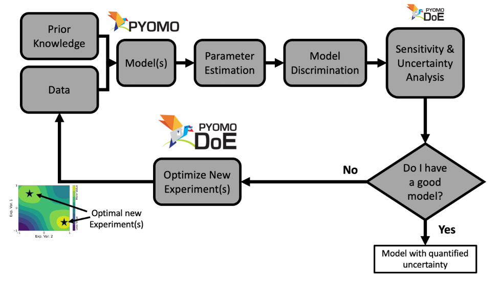

Overview
========

Model-based Design of Experiments (MBDoE) is a technique to maximize the information
gain from experiments by directly using science-based models with physically meaningful
parameters. It is one key component in the model calibration and uncertainty
quantification workflow shown below:

The parameter estimation, uncertainty analysis, and MBDoE are
combined into an iterative framework to select, refine, and calibrate science-based
mathematical models with quantified uncertainty. Currently, Pyomo.DoE focuses on
increasing parameter precision.

Pyomo.DoE provides the exploratory analysis and MBDoE capabilities to the
Pyomo ecosystem. The user provides one Pyomo model, a set of parameter nominal values,
the allowable design spaces for design variables, and the assumed observation error model.
During exploratory analysis, Pyomo.DoE checks if the model parameters can be
inferred from the postulated measurements or preliminary data.
MBDoE then recommends optimized experimental conditions for collecting more data.
Parameter estimation packages such as :ref:`Parmest <parmest>` can perform
parameter estimation using the available data to infer values for parameters,
and facilitate an uncertainty analysis to approximate the parameter covariance matrix.
If the parameter uncertainties are sufficiently small, the workflow terminates
and returns the final model with quantified parametric uncertainty.
If not, MBDoE recommends optimized experimental conditions to generate new data
that will maximize information gain and eventually reduce parameter uncertainty.

Below is an overview of the type of optimization models Pyomo.DoE can accommodate:

* Pyomo.DoE is suitable for optimization models of **continuous** variables
* Pyomo.DoE can handle **equality constraints** defining state variables
* Pyomo.DoE supports (Partial) Differential-Algebraic Equations (PDAE) models via :ref:`Pyomo.DAE <pyomo.dae>`
* Pyomo.DoE also supports models with only algebraic equations

The general form of a DAE problem that can be passed into Pyomo.DoE is shown below:

.. math::
   :nowrap:

   \[\begin{array}{l}
     \dot{\mathbf{x}}(t) = \mathbf{f}(\mathbf{x}(t), \mathbf{z}(t), \mathbf{y}(t), \mathbf{u}(t), \overline{\mathbf{w}}, \boldsymbol{\theta}) \\
     \mathbf{g}(\mathbf{x}(t),  \mathbf{z}(t), \mathbf{y}(t), \mathbf{u}(t), \overline{\mathbf{w}},\boldsymbol{\theta})=\mathbf{0} \\
     \mathbf{y} =\mathbf{h}(\mathbf{x}(t), \mathbf{z}(t), \mathbf{u}(t), \overline{\mathbf{w}},\boldsymbol{\theta}) \\
     \mathbf{f}^{\mathbf{0}}\left(\dot{\mathbf{x}}\left(t_{0}\right), \mathbf{x}\left(t_{0}\right), \mathbf{z}(t_0), \mathbf{y}(t_0), \mathbf{u}\left(t_{0}\right), \overline{\mathbf{w}}, \boldsymbol{\theta}\right)=\mathbf{0} \\
     \mathbf{g}^{\mathbf{0}}\left( \mathbf{x}\left(t_{0}\right),\mathbf{z}(t_0), \mathbf{y}(t_0), \mathbf{u}\left(t_{0}\right), \overline{\mathbf{w}}, \boldsymbol{\theta}\right)=\mathbf{0}\\
     \mathbf{y}^{\mathbf{0}}\left(t_{0}\right)=\mathbf{h}\left(\mathbf{x}\left(t_{0}\right),\mathbf{z}(t_0), \mathbf{u}\left(t_{0}\right), \overline{\mathbf{w}}, \boldsymbol{\theta}\right)
   \end{array}\]

where:

*  :math:`\boldsymbol{\theta} \in \mathbb{R}^{N_p}` are unknown model parameters.
*  :math:`\mathbf{x} \subseteq \mathcal{X}` are dynamic state variables which characterize trajectory of the system, :math:`\mathcal{X} \in \mathbb{R}^{N_x \times N_t}`.
*  :math:`\mathbf{z} \subseteq \mathcal{Z}` are algebraic state variables, :math:`\mathcal{Z} \in \mathbb{R}^{N_z \times N_t}`.
*  :math:`\mathbf{u} \subseteq \mathcal{U}` are time-varying decision variables,  :math:`\mathcal{U} \in \mathbb{R}^{N_u \times N_t}`.
*  :math:`\overline{\mathbf{w}} \in \mathbb{R}^{N_w}` are time-invariant decision variables.
*  :math:`\mathbf{y} \subseteq \mathcal{Y}` are measurement response variables,   :math:`\mathcal{Y} \in \mathbb{R}^{N_r \times N_t}`.
*  :math:`\mathbf{f}(\cdot)` are differential equations.
*  :math:`\mathbf{g}(\cdot)` are algebraic equations.
*  :math:`\mathbf{h}(\cdot)` are measurement functions.
*  :math:`\mathbf{t} \in \mathbb{R}^{N_t \times 1}` is a union of all time sets.

.. note::

    Parameters and design variables should be defined as Pyomo ``Var`` components
    when building the model using the ``Experiment`` class so that users can use both
    ``Parmest`` and ``Pyomo.DoE`` seamlessly.

Based on the above notation, the form of the MBDoE problem addressed in Pyomo.DoE is shown below:

.. math::
   :nowrap:

    \begin{equation}
    \begin{aligned}
        \underset{\boldsymbol{\varphi}}{\max} \quad & \Psi (\mathbf{M}(\boldsymbol{\hat{\theta}}, \boldsymbol{\varphi})) \\
        \text{s.t.} \quad & \mathbf{M}(\boldsymbol{\hat{\theta}}, \boldsymbol{\varphi}) = \sum_r^{N_r} \sum_{r'}^{N_r} \tilde{\sigma}_{(r,r')}\mathbf{Q}_r^\mathbf{T} \mathbf{Q}_{r'} + \mathbf{M}_0 \\
        & \dot{\mathbf{x}}(t) = \mathbf{f}(\mathbf{x}(t), \mathbf{z}(t), \mathbf{y}(t), \mathbf{u}(t), \overline{\mathbf{w}}, \boldsymbol{\hat{\theta}}) \\
        & \mathbf{g}(\mathbf{x}(t),  \mathbf{z}(t), \mathbf{y}(t), \mathbf{u}(t), \overline{\mathbf{w}},\boldsymbol{\hat{\theta}})=\mathbf{0} \\
        & \mathbf{y} =\mathbf{h}(\mathbf{x}(t), \mathbf{z}(t), \mathbf{u}(t), \overline{\mathbf{w}},\boldsymbol{\hat{\theta}}) \\
        & \mathbf{f}^{\mathbf{0}}\left(\dot{\mathbf{x}}\left(t_{0}\right), \mathbf{x}\left(t_{0}\right), \mathbf{z}(t_0), \mathbf{y}(t_0), \mathbf{u}\left(t_{0}\right), \overline{\mathbf{w}}, \boldsymbol{\hat{\theta}})\right)=\mathbf{0} \\
        & \mathbf{g}^{\mathbf{0}}\left( \mathbf{x}\left(t_{0}\right),\mathbf{z}(t_0), \mathbf{y}(t_0), \mathbf{u}\left(t_{0}\right), \overline{\mathbf{w}}, \boldsymbol{\hat{\theta}}\right)=\mathbf{0}\\
        &\mathbf{y}^{\mathbf{0}}\left(t_{0}\right)=\mathbf{h}\left(\mathbf{x}\left(t_{0}\right),\mathbf{z}(t_0), \mathbf{u}\left(t_{0}\right), \overline{\mathbf{w}}, \boldsymbol{\hat{\theta}}\right)
    \end{aligned}
    \end{equation}

where:

*  :math:`\boldsymbol{\varphi}` are design variables, which are manipulated to maximize the information content of experiments. It should consist of one or more of  :math:`\mathbf{u}(t), \mathbf{y}^{\mathbf{0}}({t_0}),\overline{\mathbf{w}}`. With a proper model formulation, the timepoints for control or measurements :math:`\mathbf{t}` can also be degrees of freedom.
*  :math:`\mathbf{M}` is the Fisher information matrix (FIM), approximated as the inverse of the covariance matrix of parameter estimates  :math:`\boldsymbol{\hat{\theta}}`. A large FIM indicates more information contained in the experiment for parameter estimation.
*  :math:`\mathbf{Q}` is the dynamic sensitivity matrix, containing the partial derivatives of  :math:`\mathbf{y}` with respect to  :math:`\boldsymbol{\theta}`.
*  :math:`\Psi` is the scalar design criteria to measure the information content in the FIM.
*  :math:`\mathbf{M}_0` is the sum of all the FIMs from previous experiments.

Pyomo.DoE provides five design criteria  :math:`\Psi` to measure the information in the FIM.
The covariance matrix of parameter estimates is approximated as the inverse of the FIM,
i.e., :math:`\mathbf{V} \approx \mathbf{M}^{-1}`.
We can use the FIM or the covariance matrix to define the design criteria.

.. list-table:: Pyomo.DoE design criteria
    :header-rows: 1
    :class: tight-table

    * - Design criterion
      - Computation
      - Geometrical meaning
    * - A-optimality
      -   :math:`\text{trace}(\mathbf{V}) = \text{trace}(\mathbf{M}^{-1})`
      - Minimizing this is equivalent to minimizing the enclosing box of the confidence ellipse
    * - Pseudo A-optimality
      -   :math:`\text{trace}(\mathbf{M})`
      - Maximizing this is equivalent to maximizing the dimensions of the enclosing box of the Fisher Information Matrix
    * - D-optimality
      -   :math:`\det(\mathbf{M}) = 1/\det(\mathbf{V})`
      - Maximizing this is equivalent to minimizing confidence-ellipsoid volume
    * - E-optimality
      -   :math:`\lambda_{\min}(\mathbf{M}) = 1/\lambda_{\max}(\mathbf{V})`
      - Maximizing this is equivalent to minimizing the longest axis of the confidence ellipse
    * - Modified E-optimality
      -   :math:`\text{cond}(\mathbf{M}) = \text{cond}(\mathbf{V})`
      - Minimizing this is equivalent to minimizing the ratio of the longest axis to the shortest axis of the confidence ellipse

.. note::

    A confidence ellipse is a geometric representation of the uncertainty in parameter
    estimates. It is derived from the covariance matrix :math:`\mathbf{V}`.

In order to solve problems of the above, Pyomo.DoE implements the 2-stage stochastic program. Please see Wang and Dowling (2022) for details.