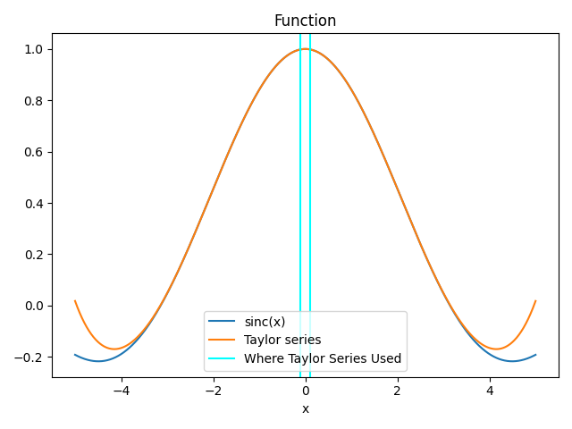
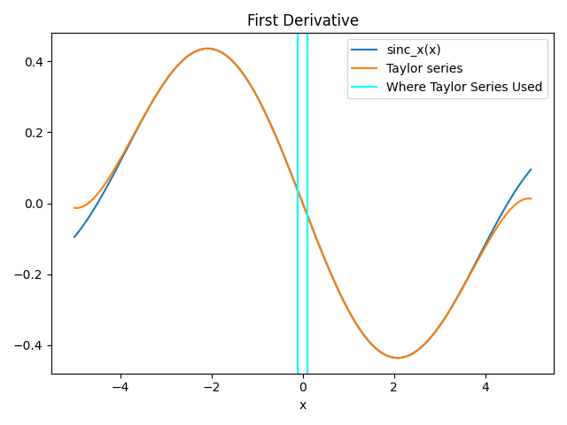
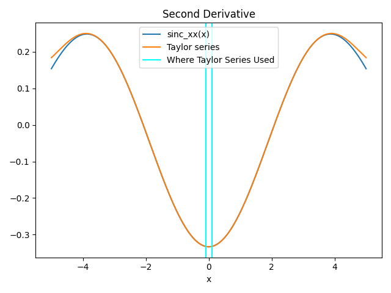
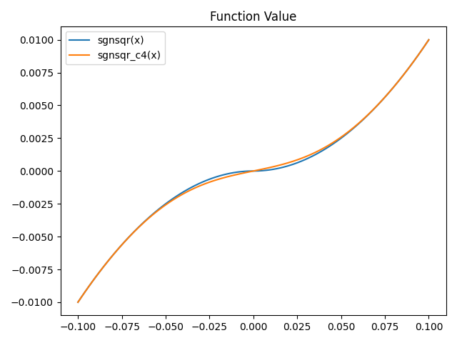
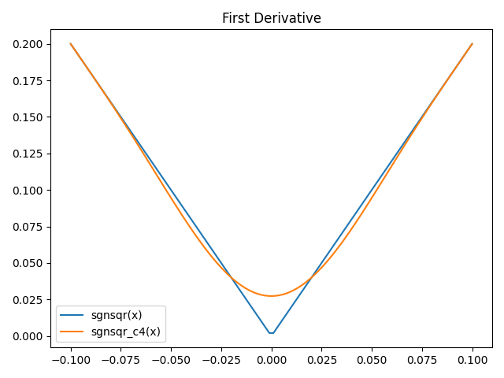
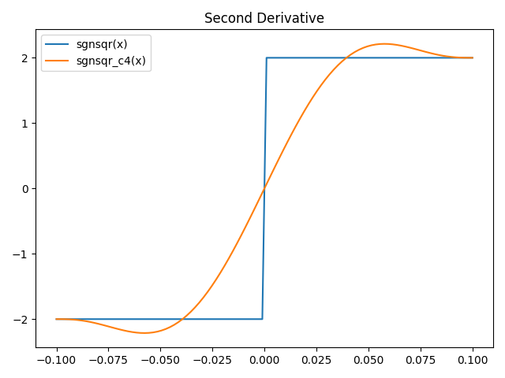
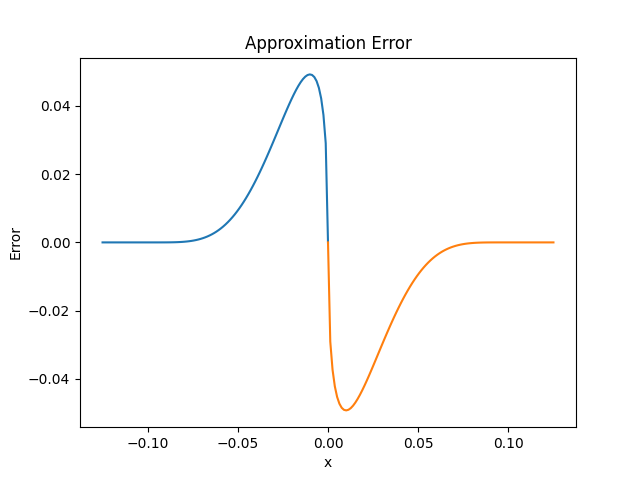
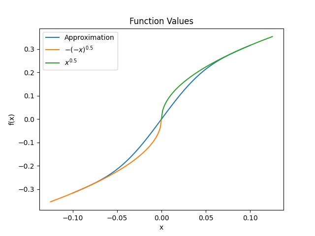
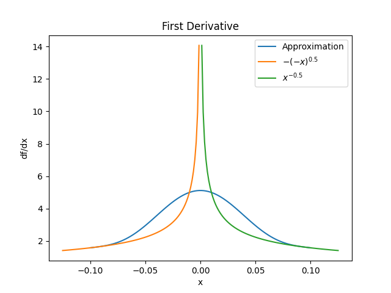
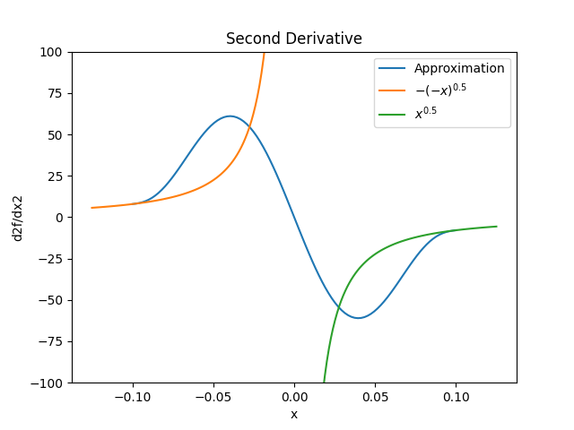

aslfunctions
============

Pyomo provides a set of AMPL user-defined functions that commonly occur but cannot be easily written as Pyomo expressions. 

Using These AMPL External Functions
-----------------------------------

Build
~~~~~

You must build the Pyomo extensions to use these functions.  Run ``pyomo build-extensions`` in the terminal and make sure the ``aslfunctions`` build status is "ok."

Example
~~~~~~~

.. doctest::

    >>> import pyomo.environ as pyo
    >>> from pyomo.common.fileutils import find_library
    >>> flib = find_library("aslfunctions")
    >>> m = pyo.ConcreteModel(name = 'AMPLExternalFunctions')
    >>> m.sinc = pyo.ExternalFunction(library=flib, function="sinc")
    >>> m.x = pyo.Var()
    >>> m.z = pyo.Var()
    >>> m.constraint = pyo.Constraint(expr = m.z == m.sinc(m.x))

Functions
---------

sinc(x)
~~~~~~~

This function is defined as:

.. math::

    \text{sinc}(x) = \begin{cases}
        \sin(x) / x & \text{if } x \neq 0 \\
        1 & \text{if } x = 0
    \end{cases}

In this implementation, the region :math:`-0.1 < x < 0.1` is replaced by a Taylor series with enough terms that the function should be at least :math:`C^2` smooth.  The difference between the function and the Tayor series is near the limits of machine precision, about :math:`1 \times 10^{-16}` for the function value,  :math:`1 \times 10^{-16}` for the first derivative, and :math:`1 \times 10^{-14}` for the second derivative.

These figures show the sinc(x) function, the Taylor series and where the Taylor series is used.

sgnsqr(x)
~~~~~~~~~

This function is defined as:

.. math::

    \text{sgnsqr}(x) = \text{sgn}(x)x^2

This function is only :math:`C^1` smooth because at 0 the second derivative is undefined and the jumps from -2 to 2.  

sgnsqr_c4(x)
~~~~~~~~~~~~

This function is defined as:

.. math::

   \operatorname{sgnsqr\_c4}(x) =
   \begin{cases}
       \operatorname{sgn}(x)\,x^2 & \text{if } |x| \ge 0.1, \\
       \displaystyle\sum_{i=0}^{11} c_i x^i & \text{if } |x| < 0.1
   \end{cases}

This function is :math:`C^4` smooth. The region :math:`-0.1 < x < 0.1` is replaced by an 11th order polynomial that approximates :math:`\text{sgn}(x)x^2`. This function has well behaved derivatives at :math:`x=0`. If you need to use this function with very small numbers and high accuracy is important, you can scale the argument up (e.g. :math:`\operatorname{sgnsqr\_c4}(sx)/s^2`).

These figures show the sgnsqr(x) function compared to the smooth approximation sgnsqr_c4(x).

sgnsqrt_c4(x)
~~~~~~~~~~~~~

This function is a signed square root approximation defined as:

.. math::

   \operatorname{sgnsqrt\_c4}(x) =
   \begin{cases}
       \operatorname{sgn}(x)\,|x|^{0.5} & \text{if } |x| \ge 0.1, \\
       \displaystyle\sum_{i=0}^{11} c_i x^i & \text{if } |x| < 0.1
   \end{cases}

This function is :math:`C^4` smooth.  The region :math:`-0.1 < x < 0.1` is replaced by an 11th order polynomial that approximates :math:`\text{sgn}(x)|x|^{0.5}`.  This function has well behaved derivatives at :math:`x=0`.  If you need to use this function with very small numbers and high accuracy is important, you can scale the argument up (e.g. :math:`\operatorname{sgnsqrt\_c4}(sx)/s^{0.5}`).

These figures show the signed square root function compared to the smooth approximation sgnsqrt_c4(x).

