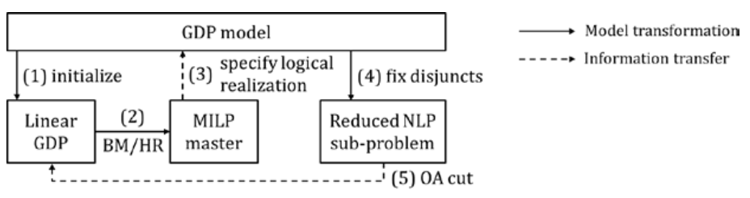

.. _gdpopt-main-page:

GDPopt logic-based solver
=========================

The GDPopt solver in Pyomo allows users to solve nonlinear Generalized
Disjunctive Programming (GDP) models using logic-based decomposition
approaches, as opposed to the conventional approach via reformulation to a
Mixed Integer Nonlinear Programming (MINLP) model.

The main advantage of these techniques is their ability to solve subproblems
in a reduced space, including nonlinear constraints only for ``True`` logical blocks.
As a result, GDPopt is most effective for nonlinear GDP models.

Four algorithms are available in GDPopt:

1. Logic-based outer approximation (LOA) [`Turkay & Grossmann, 1996`_]
2. Global logic-based outer approximation (GLOA) [`Lee & Grossmann, 2001`_]
3. Logic-based branch-and-bound (LBB) [`Lee & Grossmann, 2001`_]
4. Logic-based discrete steepest descent algorithm (LD-SDA) [`Ovalle et al., 2025`_]

Usage and implementation details for GDPopt can be found in the PSE 2018 paper
(`Chen et al., 2018`_), or via its
`preprint <https://egon.cheme.cmu.edu/Papers/Chen_Pyomo_GDP_PSE2018.pdf>`_.

Credit for prototyping and development can be found in the ``GDPopt`` class documentation, below.

.. _Turkay & Grossmann, 1996: https://dx.doi.org/10.1016/0098-1354(95)00219-7
.. _Lee & Grossmann, 2001: https://doi.org/10.1016/S0098-1354(01)00732-3
.. _Lee & Grossmann, 2000: https://doi.org/10.1016/S0098-1354(00)00581-0
.. _Chen et al., 2018: https://doi.org/10.1016/B978-0-444-64241-7.50143-9
.. _Ovalle et al., 2025: https://doi.org/10.1016/j.compchemeng.2024.108993

GDPopt can be used to solve a Pyomo.GDP concrete model in two ways.
The simplest is to instantiate the generic GDPopt solver and specify the desired algorithm as an argument to the ``solve`` method:

.. code::

  >>> pyo.SolverFactory('gdpopt').solve(model, algorithm='LOA')

The alternative is to instantiate an algorithm-specific GDPopt solver:

.. code::

  >>> pyo.SolverFactory('gdpopt.loa').solve(model)

In the above examples, GDPopt uses the GDPopt-LOA algorithm.
Other algorithms may be used by specifying them in the ``algorithm`` argument when using the generic solver or by instantiating the algorithm-specific GDPopt solvers. All GDPopt options are listed below.

.. note::

  The generic GDPopt solver allows minimal configuration outside of the arguments to the ``solve`` method. To avoid repeatedly specifying the same configuration options to the ``solve`` method, use the algorithm-specific solvers.

Logic-based Outer Approximation (LOA)
-------------------------------------

`Chen et al., 2018`_ contains the following flowchart, taken from the preprint version:

An example that includes the modeling approach may be found below.

.. doctest::
  :skipif: not glpk_available

  Required imports
  >>> import pyomo.environ as pyo
  >>> from pyomo.gdp import Disjunct, Disjunction

  Create a simple model
  >>> model = pyo.ConcreteModel(name='LOA example')

  >>> model.x = pyo.Var(bounds=(-1.2, 2))
  >>> model.y = pyo.Var(bounds=(-10,10))
  >>> model.c = pyo.Constraint(expr= model.x + model.y == 1)

  >>> model.fix_x = Disjunct()
  >>> model.fix_x.c = pyo.Constraint(expr=model.x == 0)

  >>> model.fix_y = Disjunct()
  >>> model.fix_y.c = pyo.Constraint(expr=model.y == 0)

  >>> model.d = Disjunction(expr=[model.fix_x, model.fix_y])
  >>> model.objective = pyo.Objective(expr=model.x + 0.1*model.y, sense=pyo.minimize)

  Solve the model using GDPopt
  >>> results = pyo.SolverFactory('gdpopt.loa').solve(
  ...     model, mip_solver='glpk') # doctest: +IGNORE_RESULT

  Display the final solution
  >>> model.display()
  Model LOA example
  <BLANKLINE>
    Variables:
      x : Size=1, Index=None
          Key  : Lower : Value : Upper : Fixed : Stale : Domain
          None :  -1.2 :     0 :     2 : False : False :  Reals
      y : Size=1, Index=None
          Key  : Lower : Value : Upper : Fixed : Stale : Domain
          None :   -10 :     1 :    10 : False : False :  Reals
  <BLANKLINE>
    Objectives:
      objective : Size=1, Index=None, Active=True
          Key  : Active : Value
          None :   True :   0.1
  <BLANKLINE>
    Constraints:
      c : Size=1
          Key  : Lower : Body : Upper
          None :   1.0 :    1 :   1.0

.. note:: 

   When troubleshooting, it can often be helpful to turn on verbose
   output using the ``tee`` flag.

.. code::

  >>> pyo.SolverFactory('gdpopt.loa').solve(model, tee=True)

Global Logic-based Outer Approximation (GLOA)
---------------------------------------------

The same algorithm can be used to solve GDPs involving nonconvex nonlinear constraints by solving the subproblems globally:

.. code::

  >>> pyo.SolverFactory('gdpopt.gloa').solve(model)

.. warning::

  The ``nlp_solver`` option must be set to a global solver for the solution returned by GDPopt to also be globally optimal.

Relaxation with Integer Cuts (RIC)
----------------------------------

Instead of outer approximation, GDPs can be solved using the same MILP relaxation as in the previous two algorithms, but instead of using the subproblems to generate outer-approximation cuts, the algorithm adds only no-good cuts for every discrete solution encountered:

.. code::

  >>> pyo.SolverFactory('gdpopt.ric').solve(model)

Again, this is a global algorithm if the subproblems are solved globally, and is not otherwise.

.. note::

  The RIC algorithm will not necessarily enumerate all discrete solutions as it is possible for the bounds to converge first. However, full enumeration is not uncommon.

Logic-based Branch-and-Bound (LBB)
----------------------------------

The GDPopt-LBB solver branches through relaxed subproblems with inactive disjunctions.
It explores the possibilities based on best lower bound,
eventually activating all disjunctions and presenting the globally optimal solution.

To use the GDPopt-LBB solver, define your Pyomo GDP model as usual:

.. doctest::
  :skipif: not baron_available

  Required imports
  >>> import pyomo.environ as pyo
  >>> from pyomo.gdp import Disjunct, Disjunction

  Create a simple model
  >>> m = pyo.ConcreteModel()
  >>> m.x1 = pyo.Var(bounds = (0,8))
  >>> m.x2 = pyo.Var(bounds = (0,8))
  >>> m.obj = pyo.Objective(expr=m.x1 + m.x2, sense=pyo.minimize)
  >>> m.y1 = Disjunct()
  >>> m.y2 = Disjunct()
  >>> m.y1.c1 = pyo.Constraint(expr=m.x1 >= 2)
  >>> m.y1.c2 = pyo.Constraint(expr=m.x2 >= 2)
  >>> m.y2.c1 = pyo.Constraint(expr=m.x1 >= 3)
  >>> m.y2.c2 = pyo.Constraint(expr=m.x2 >= 3)
  >>> m.djn = Disjunction(expr=[m.y1, m.y2])

  Invoke the GDPopt-LBB solver

  >>> results = pyo.SolverFactory('gdpopt.lbb').solve(m)
  WARNING: 09/06/22: The GDPopt LBB algorithm currently has known issues. Please
      use the results with caution and report any bugs!

  >>> print(results)  # doctest: +SKIP
  >>> print(results.solver.status)
  ok
  >>> print(results.solver.termination_condition)
  optimal

  >>> print([pyo.value(m.y1.indicator_var), pyo.value(m.y2.indicator_var)])
  [True, False]

Logic-based Discrete-Steepest Descent Algorithm (LD-SDA)
--------------------------------------------------------

The GDPopt-LDSDA solver exploits the ordered Boolean variables in the disjunctions to solve the GDP model.
It requires an **exclusive OR (XOR) logical constraint** to ensure that exactly one disjunct is active in each disjunction. 
The solver also requires a **starting point** for the discrete variables and allows users to choose between two **direction norms**, `'L2'` and `'Linf'`, to guide the search process.

.. note::

  The current implementation of the GDPopt-LDSDA requires an explicit LogicalConstraint to enforce the exclusive OR condition for each disjunction.

To use the GDPopt-LDSDA solver, define your Pyomo GDP model as usual:

.. doctest::
  :skipif: not baron_available

  Required imports
  >>> import pyomo.environ as pyo
  >>> from pyomo.gdp import Disjunct, Disjunction

  Create a simple model
  >>> m = pyo.ConcreteModel()

  Define sets
  >>> I = [1, 2, 3, 4, 5]
  >>> J = [1, 2, 3, 4, 5]

  Define variables
  >>> m.a = pyo.Var(bounds=(-0.3, 0.2))
  >>> m.b = pyo.Var(bounds=(-0.9, -0.5))

  Define disjuncts for Y1
  >>> m.Y1_disjuncts = Disjunct(I)
  >>> for i in I:
  ...     m.Y1_disjuncts[i].y1_constraint = pyo.Constraint(expr=m.a == -0.3 + 0.1 * (i - 1))

  Define disjuncts for Y2
  >>> m.Y2_disjuncts = Disjunct(J)
  >>> for j in J:
  ...     m.Y2_disjuncts[j].y2_constraint = pyo.Constraint(expr=m.b == -0.9 + 0.1 * (j - 1))

  Define disjunctions
  >>> m.y1_disjunction = Disjunction(expr=[m.Y1_disjuncts[i] for i in I])
  >>> m.y2_disjunction = Disjunction(expr=[m.Y2_disjuncts[j] for j in J])

  Logical constraints to enforce exactly one selection
  >>> m.Y1_limit = pyo.LogicalConstraint(expr=pyo.exactly(1, [m.Y1_disjuncts[i].indicator_var for i in I]))
  >>> m.Y2_limit = pyo.LogicalConstraint(expr=pyo.exactly(1, [m.Y2_disjuncts[j].indicator_var for j in J]))

  Define objective function
  >>> m.obj = pyo.Objective(
  ...     expr=4 * m.a**2 - 2.1 * m.a**4 + (1 / 3) * m.a**6 + m.a * m.b - 4 * m.b**2 + 4 * m.b**4,
  ...     sense=pyo.minimize
  ... )

  Invoke the GDPopt-LDSDA solver
  >>> results = pyo.SolverFactory('gdpopt.ldsda').solve(m,
  ...     starting_point=[1,1],
  ...     logical_constraint_list=[m.Y1_limit, m.Y2_limit],
  ...     direction_norm='Linf',
  ... )
GDPopt implementation and optional arguments
--------------------------------------------

.. warning:: 

   GDPopt optional arguments should be considered beta code and are
   subject to change.

.. autosummary::

   ~pyomo.contrib.gdpopt.GDPopt.GDPoptSolver
   ~pyomo.contrib.gdpopt.loa.GDP_LOA_Solver
   ~pyomo.contrib.gdpopt.gloa.GDP_GLOA_Solver
   ~pyomo.contrib.gdpopt.ric.GDP_RIC_Solver
   ~pyomo.contrib.gdpopt.branch_and_bound.GDP_LBB_Solver
   ~pyomo.contrib.gdpopt.ldsda.GDP_LDSDA_Solver

