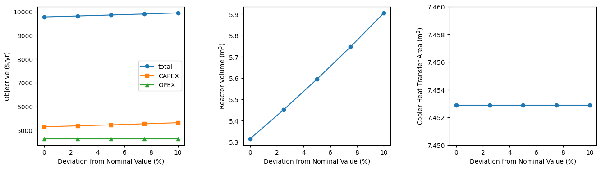

.. _pyros_tutorial:

====================
PyROS Usage Tutorial
====================

.. contents:: Table of Contents
   :depth: 3
   :local:

This tutorial is an in-depth guide on how to
use PyROS to solve a two-stage robust optimization problem.
The problem is taken from the area of chemical process systems design.

Setup
-----
To successfully run this tutorial, you will need to
:ref:`install PyROS <pyros_installation>`
along with at least one local
nonlinear programming
(NLP) solver and at least one global NLP solver.
In particular, this tutorial uses
`IPOPT <https://github.com/coin-or/Ipopt>`__
as the local solver,
`BARON <https://minlp.com/baron-solver>`__
as the global solver,
and `COUENNE <https://github.com/coin-or/Couenne>`__
as a backup global solver.

You will also need to
`install Matplotlib <https://matplotlib.org/stable/install/index.html>`__,
which is used to generate plots in this tutorial.
Further, we recommend installing
an `interactive Matplotlib backend
<https://matplotlib.org/stable/users/explain/figure/backends.html#interactive-backends>`_
for quick and easy viewing of plots.

Prepare the Deterministic Model
-------------------------------

PyROS is designed to operate on a user-supplied deterministic NLP. We
now set out to prepare a deterministic NLP that can be solved tractably
with subordinate NLP optimizers.

Formulate the Model
~~~~~~~~~~~~~~~~~~~

Consider the reactor-cooler system below.

   Reactor-cooler system process flowsheet,
   adapted from [Dje20]_.
   Constants are set in boldface.

A stream of chemical species :math:`E` enters the
reactor with a molar flow rate :math:`F_0 = 45.36\,\text{kmol/h}`,
absolute temperature :math:`T_0 = 333\,\text{K}`,
concentration :math:`\boldsymbol{c}_{E0} = 32.04\, \text{kmol}/\text{m}^3`,
and heat capacity
:math:`\boldsymbol{c}_p = 167.4\,\text{kJ}/ \text{kmol}\,\text{K}`.
Inside the reactor, the exothermic reaction :math:`E \to F` occurs
at temperature :math:`T_1` and with a conversion of 90%,
so that :math:`\boldsymbol{c}_{E1} = 0.1\boldsymbol{c}_{E0}`.
We assume that the reaction
follows first-order kinetics, with a rate constant
:math:`\boldsymbol{k}_\text{R}` of nominal value
:math:`10\,\text{hr}^{-1}` and normalized activation energy
:math:`\boldsymbol{E/R} = 555.6\,\text{K}`.
Further, the molar heat of reaction is
:math:`\boldsymbol{\Delta H}_\text{R}=-23260\,\text{kJ/kmol}`.

A portion of the product is cooled to a temperature :math:`T_2`
then recycled to the reactor.
Cooling water, with heat capacity
:math:`\boldsymbol{c}_{w,p} = 4.184\,\text{kJ}/\text{kg}\,\text{K}`
and inlet
temperature :math:`\boldsymbol{T}_{w1} = 300\,\text{K}`, is used as the
cooling medium. The heat transfer coefficient of the cooling unit is of
nominal value
:math:`\boldsymbol{U} = 1635\,\text{kJ}/\text{m}^2\,\text{kg}\,\text{h}`.

We are interested in optimizing the design and operation of the system:

- The design is specified through the reactor volume :math:`\hat{V}` and
  the area :math:`A` of the heat exchanger used to cool the recycle stream.
- The operation of the system can be adjusted via the reactor outlet
  temperature :math:`T_1` and recycle stream flow rate :math:`F_1`.

Modified from the formulations presented in
[HG83]_, [YLH18]_, [Dje20]_, and [IAE+21]_,
the deterministic optimization model for the system of interest
can be written as

.. math::

   \begin{array}{cl}
       \displaystyle\min_{\substack{
           (\hat{V},A, c_{E1}) \in [0, 10] \times [0, 20]\\
           (F_1, T_1) \in \mathbb{R}^{3}\\
           (T_2, T_{w2}, \dot{Q}_{\text{HE}}, F_w, V) \in \mathbb{R}^{5}
       }}
       &  
           691.2 \hat{V}^{0.7}
           + 873.6 A^{0.6}
           + 7.056 F_{1}
           + 1.760 F_{w}
       \\
       \text{s.t.}
       &  
       \displaystyle\boldsymbol{F}_{0} \left(\frac{\boldsymbol{c}_{E0} - \boldsymbol{c}_{E1}}{\boldsymbol{c}_{E0}}\right)
       = V \boldsymbol{k}_{\text{R}} \exp{\left(-\frac{\boldsymbol{E}}{\boldsymbol{R}T_1}\right)}\boldsymbol{c}_{E1}
       \\
       & \displaystyle
       -\boldsymbol{\Delta}\boldsymbol{H}_{\text{R}}\boldsymbol{F}_{0}
           \left(\frac{\boldsymbol{c}_{E0} - \boldsymbol{c}_{E1}}{\boldsymbol{c}_{E0}}\right)
           =
           \boldsymbol{F}_{0}\boldsymbol{c}_{p}(T_1 - \boldsymbol{T}_0)
           + \dot{Q}_{\text{HE}}
       \\
       & 
       \dot{Q}_{\text{HE}}
           =
           F_1 \boldsymbol{c}_{p}(T_1 - T_2)
       \\
       & 
       \dot{Q}_{\text{HE}}
           =
           F_w \boldsymbol{c}_{w,p}(T_{w2} - \boldsymbol{T}_{w1})
       \\
       &  \displaystyle
       \dot{Q}_{\text{HE}}
           =
           \boldsymbol{U}A \left(
           \frac{(T_1 - T_{w2}) - (T_2 - \boldsymbol{T}_{w1})}{
               \ln{(T_1 - T_{w2})} - \ln{(T_{2} - \boldsymbol{T}_{w1})}
           }
           \right)
       \\
       & 
       0 \leq V \leq \hat{V}
       \\
       & 
       311 \leq T_1, T_2 \leq 389
       \\
       & 
       301 \leq T_{w2} \leq 355
       \\
       & 
       1 \leq T_1 - T_2
       \\
       & 
       1 \leq T_{w2} - \boldsymbol{T}_{w1}
       \\
       & 
       11.1 \leq T_1 - T_{w2}
       \\
       & 
       11.1 \leq T_2 - \boldsymbol{T}_{w1}
   \end{array}

in which:

-  :math:`V` is the reactor holdup volume during operation (in
   :math:`\text{m}^3`)
-  :math:`F_w` is the mass flow rate of cooling water (in
   :math:`\text{kg/hr}`)
-  :math:`T_2` is the temperature to which the recycle stream is cooled
   (in :math:`\text{K}`)
-  :math:`T_{w2}` is the cooling water return temperature (in
   :math:`\text{K}`)
-  :math:`\dot{Q}_\text{HE}` is the cooling duty of the heat exchanger
   (in :math:`\text{kW}`)

The objective function yields the total annualized cost,
with units of $/yr.

Once the design :math:`(\hat{V}, A)` and operation :math:`(F_1, T_1)` of
the system are specified, the state variables
:math:`(V, \dot{Q}_\text{HE}, F_w, T_{w2}, T_2)` are calculated using
the equality constraints, which comprise a square system of nonlinear
equations.

Implement the Model
~~~~~~~~~~~~~~~~~~~

We now implement the deterministic model for the reactor-cooler system.
First, we import Pyomo:

.. code::

    >>> import pyomo.environ as pyo

and write a function for building the
model (with the variables uninitialized):

.. code::

    >>> def build_model():
    ...     m = pyo.ConcreteModel()
    ... 
    ...     # certain parameters
    ...     m.cA0 = pyo.Param(initialize=32.040)
    ...     m.cA1 = pyo.Param(initialize=0.1 * m.cA0)
    ...     m.EovR = pyo.Param(initialize=555.6)
    ...     m.delHr = pyo.Param(initialize=-23260)
    ...     m.cp = pyo.Param(initialize=167.400)
    ...     m.cwp = pyo.Param(initialize=4.184)
    ...     m.F0 = pyo.Param(initialize=45.36)
    ...     m.T0 = pyo.Param(initialize=333)
    ...     m.Tw1 = pyo.Param(initialize=300)
    ...
    ...     # uncertain parameters
    ...     m.kR = pyo.Param(initialize=10, mutable=True)
    ...     m.U = pyo.Param(initialize=1635, mutable=True)
    ... 
    ...     # first-stage variables
    ...     m.Vhat = pyo.Var(bounds=(0, 20))
    ...     m.A = pyo.Var(bounds=(0, 10))
    ... 
    ...     # second-stage variables
    ...     m.F1 = pyo.Var()
    ...     m.T1 = pyo.Var(bounds=(311, 389))
    ... 
    ...     # state variables
    ...     m.V = pyo.Var(bounds=(0, None))
    ...     m.Qhe = pyo.Var()
    ...     m.T2 = pyo.Var(bounds=(311, 389))
    ...     m.Tw2 = pyo.Var(bounds=(301, 355))
    ...     m.Fw = pyo.Var()
    ... 
    ...     # objective and constituent expressions
    ...     m.capex = pyo.Expression(expr=691.2 * m.Vhat ** 0.7 + 873.6 * m.A ** 0.6)
    ...     m.opex = pyo.Expression(expr=1.76 * m.Fw + 7.056 * m.F1)
    ...     m.obj = pyo.Objective(expr=m.capex + m.opex)
    ... 
    ...     # equality constraints
    ...     m.reactant_mol_bal = pyo.Constraint(
    ...         expr=(
    ...             m.F0 * ((m.cA0 - m.cA1) / m.cA0)
    ...             == m.V * m.kR * pyo.exp(-m.EovR / m.T1) * m.cA1
    ...         ),
    ...     )
    ...     m.reactant_heat_bal = pyo.Constraint(
    ...         expr=(
    ...             -m.delHr * m.F0 * ((m.cA0 - m.cA1) / m.cA0)
    ...             == m.F0 * m.cp * (m.T1 - m.T0)
    ...             + m.Qhe
    ...         )
    ...     )
    ...     m.heat_bal_process = pyo.Constraint(
    ...         expr=m.Qhe == m.F1 * m.cp * (m.T1 - m.T2)
    ...     )
    ...     m.heat_bal_util = pyo.Constraint(
    ...         expr=m.Qhe == m.Fw * m.cwp * (m.Tw2 - m.Tw1)
    ...     )
    ... 
    ...     @m.Constraint()
    ...     def hex_design_eq(mdl):
    ...         dt1 = mdl.T1 - mdl.Tw2
    ...         dt2 = mdl.T2 - mdl.Tw1
    ...         lmtd_expr = (dt1 - dt2) / (pyo.log(dt1) - pyo.log(dt2))
    ...         return m.Qhe == m.A * m.U * lmtd_expr
    ... 
    ...     # inequality constraints
    ...     m.V_con = pyo.Constraint(expr=(m.V <= m.Vhat))
    ...     m.T1T2_con = pyo.Constraint(expr=(1 <= m.T1 - m.T2))
    ...     m.Tw1Tw2_con = pyo.Constraint(expr=(1 <= m.Tw2 - m.Tw1))
    ...     m.T1Tw2_con = pyo.Constraint(expr=(11.1 <= m.T1 - m.Tw2))
    ...     m.T2Tw1_con = pyo.Constraint(expr=(11.1 <= m.T2 - m.Tw1))
    ... 
    ...     return m
    ...

.. note::

    Observe that the :class:`~pyomo.core.base.param.Param`
    objects representing the potentially uncertain parameters
    :math:`\boldsymbol{k}_\text{R}` and :math:`\boldsymbol{U}`
    are declared with the argument ``mutable=True``,
    as PyROS requires that :class:`~pyomo.core.base.param.Param`
    objects representing uncertain parameters
    be mutable.
    Alternatively, 
    :math:`\boldsymbol{k}_\text{R}` and :math:`\boldsymbol{U}`
    may have instead been implemented as fixed
    :class:`~pyomo.core.base.var.Var` objects,
    as follows:

    .. code-block::

       m.kR = pyo.Var(initialize=10)
       m.U = pyo.Var(initialize=1635)
       m.kR.fix(); m.U.fix()

    For more information on implementing uncertain parameters for PyROS,
    see the
    :ref:`Uncertain Parameters section of the Solver Interface
    documentation <pyros_uncertain_params>`.

For convenience, we also write a function to initialize the model's
variable values:

.. code::

    >>> from pyomo.util.calc_var_value import calculate_variable_from_constraint
    >>>
    >>> def initialize_model(m, Vhat=20, A=10, F1=50, T1=389):
    ...     # set first-stage and second-stage variable values
    ...     m.Vhat.set_value(Vhat)
    ...     m.A.set_value(A)
    ...     m.F1.set_value(F1)
    ...     m.T1.set_value(T1)
    ... 
    ...     # solve equations for state variables
    ...     calculate_variable_from_constraint(
    ...         variable=m.V,
    ...         constraint=m.reactant_mol_bal,
    ...     )
    ...     calculate_variable_from_constraint(
    ...         variable=m.Qhe,
    ...         constraint=m.reactant_heat_bal,
    ...     )
    ...     calculate_variable_from_constraint(
    ...         variable=m.T2,
    ...         constraint=m.heat_bal_process,
    ...     )
    ...     calculate_variable_from_constraint(
    ...         variable=m.Tw2,
    ...         constraint=m.hex_design_eq,
    ...     )
    ...     calculate_variable_from_constraint(
    ...         variable=m.Fw,
    ...         constraint=m.heat_bal_util,
    ...     )
    ...

And finally, a function to build the model and
initialize the variable values:

.. code::

    >>> def build_and_initialize_model(**init_kwargs):
    ...     m = build_model()
    ...     initialize_model(m, **init_kwargs)
    ...     return m
    ...

We may now instantiate and initialize the model as follows:

.. code::

    >>> m = build_and_initialize_model()

The following helper function will be useful for inspecting
the current solution:

.. code::

    >>> def print_solution(model):
    ...     print(f"Objective      ($/yr)    : {pyo.value(model.obj):.2f}")
    ...     print(f"Reactor volume (m^3)     : {model.Vhat.value:.2f}")
    ...     print(f"Cooler area    (m^2)     : {model.A.value:.2f}")
    ...     print(f"F1             (kmol/hr) : {model.F1.value:.2f}")
    ...     print(f"T1             (K)       : {model.T1.value:.2f}")
    ...     print(f"Fw             (kg/hr)   : {model.Fw.value:.2f}")
    ...

Inspecting the initial model solution:

.. code::

    >>> print_solution(m)  # may vary
    Objective      ($/yr)    : 13830.89
    Reactor volume (m^3)     : 20.00
    Cooler area    (m^2)     : 10.00
    F1             (kmol/hr) : 50.00
    T1             (K)       : 389.00
    Fw             (kg/hr)   : 2484.43

Solve the Model Deterministically
~~~~~~~~~~~~~~~~~~~~~~~~~~~~~~~~~

We use IPOPT to solve the model to local optimality:

.. _pyros_tutorial_nominal_solve:

.. code::

    >>> ipopt = pyo.SolverFactory("ipopt")
    >>> pyo.assert_optimal_termination(ipopt.solve(m, tee=True, load_solutions=True))
    Ipopt ...
    ...
    EXIT: Optimal Solution Found.

We are able to solve the model to local optimality. Inspecting the
solution, we notice reductions in the objective and the main variables
of interest compared to the initial point used:

.. _pyros_tutorial_inspect_nominal:

.. code::

    >>> print_solution(m)  # may vary
    Objective      ($/yr)    : 9774.58
    Reactor volume (m^3)     : 5.32
    Cooler area    (m^2)     : 7.45
    F1             (kmol/hr) : 88.32
    T1             (K)       : 389.00
    Fw             (kg/hr)   : 2278.57

Assess Impact of Parametric Uncertainty
---------------------------------------

Suppose the reaction rate constant :math:`\boldsymbol{k}_\text{R}` and
heat transfer coefficient :math:`\boldsymbol{U}` are uncertain. We
assume that each parameter may deviate from its nominal value by up to
5%, and that the deviations are independent. Thus, the joint
realizations of the uncertain parameters are confined to a rectangular
region, that is, a box.

Given a *fixed* design :math:`(\hat{V}, A)`, we wish to assess whether
we can guarantee that the operational variables :math:`(F_1, T_1)`, and
concomitantly, the state
:math:`(V, \dot{Q}_\text{HE}, T_2, T_{w2}, F_w)`, can be adjusted to a
feasible solution under any plausible realization of the uncertain
parameters. This assessment can be carried out with the following
function:

.. code::

    >>> # module imports needed
    >>> import numpy as np
    >>> import matplotlib.pyplot as plt
    >>> import matplotlib.patches as patches
    >>> 
    >>> def plot_feasibility(solutions, solver, samples=200, test_set_size=10):
    ...     # seed the random number generator for deterministic sampling
    ...     rng = np.random.default_rng(123456)
    ... 
    ...     # nominal uncertain parameter realizations
    ...     nom_vals = np.array([10, 1635])
    ... 
    ...     # sample points from box uncertainty set of specified test size
    ...     point_samples = np.empty((samples, 2))
    ...     point_samples[0] = nom_vals
    ...     point_samples[1:] = rng.uniform(
    ...         low=nom_vals * (1 - test_set_size / 100),
    ...         high=nom_vals * (1 + test_set_size / 100),
    ...         size=(samples - 1, 2),
    ...     )
    ... 
    ...     costs = np.empty((len(solutions), point_samples.shape[0]), dtype=float)
    ...     mdl = build_model()
    ...     for sol_idx, (size, sol) in enumerate(solutions.items()):
    ...         # fix the first-stage variables
    ...         mdl.Vhat.fix(sol[0])
    ...         mdl.A.fix(sol[1])
    ...         
    ...         for pt_idx, pt in enumerate(point_samples):
    ...             # update parameter realization to sampled point
    ...             mdl.kR.set_value(pt[0])
    ...             mdl.U.set_value(pt[1])
    ... 
    ...             # update the values of the operational variables
    ...             initialize_model(mdl, Vhat=sol[0], A=sol[1])
    ... 
    ...             # try solving the model to inspect for feasibility
    ...             res = solver.solve(mdl, load_solutions=False)
    ...             if pyo.check_optimal_termination(res):
    ...                 mdl.solutions.load_from(res)
    ...                 costs[sol_idx, pt_idx] = pyo.value(mdl.obj)
    ...             else:
    ...                 costs[sol_idx, pt_idx] = np.nan
    ... 
    ...     # now generate the plot(s)
    ...     fig, axs = plt.subplots(
    ...         figsize=(0.5 * (len(solutions) - 1) + 5 * len(solutions), 4),
    ...         ncols=len(solutions),
    ...         squeeze=False,
    ...         sharey=True,
    ...         layout="constrained",
    ...     )
    ...     for sol_idx, (size, ax) in enumerate(zip(solutions, axs[0])):
    ...         # track realizations for which solution feasible
    ...         is_feas = ~np.isnan(costs[sol_idx])
    ... 
    ...         # realizations under which design is feasible
    ...         # (colored by objective)
    ...         plot = ax.scatter(
    ...             point_samples[is_feas][:, 0],
    ...             point_samples[is_feas][:, 1],
    ...             c=costs[sol_idx, is_feas],
    ...             vmin=np.nanmin(costs),
    ...             vmax=np.nanmax(costs),
    ...             cmap="plasma_r",
    ...             marker="o",
    ...         )
    ...         # realizations under which design is infeasible
    ...         ax.scatter(
    ...             point_samples[~is_feas][:, 0],
    ...             point_samples[~is_feas][:, 1],
    ...             color="none",
    ...             edgecolors="black",
    ...             label="infeasible",
    ...             marker="^",
    ...         )
    ...         if size != 0:
    ...             # boundary of the box uncertainty set mapped to the design
    ...             rect = patches.Rectangle(
    ...                 nom_vals * (1 - size / 100),
    ...                 *tuple(nom_vals * 2 * size / 100),
    ...                 facecolor="none",
    ...                 edgecolor="black",
    ...                 linestyle="dashed",
    ...                 label=f"{size}% box set",
    ...             )
    ...             ax.add_patch(rect)
    ...             
    ...         ax.legend(bbox_to_anchor=(1, -0.15), loc="upper right")
    ...         ax.set_xlabel(r"$k_\mathrm{R}$ (per hr)")
    ...         ax.set_ylabel("$U$ (kJ/sqm-h-K)")
    ... 
    ...         is_in_set = np.logical_and(
    ...             np.all(nom_vals * (1 - size / 100) <= point_samples, axis=1),
    ...             np.all(point_samples <= nom_vals * (1 + size / 100), axis=1),
    ...         )
    ...         feas_in_set = np.logical_and(is_feas, is_in_set)
    ...         
    ...         # add plot title summarizing statistics of the results
    ...         ax.set_title(
    ...             f"Solution for {size}% box set\n"
    ...             "Avg ± SD objective "
    ...             f"{costs[sol_idx, is_feas].mean():.2f} ± {costs[sol_idx, is_feas].std():.2f}\n"
    ...             f"Feas. for {feas_in_set.sum()}/{is_in_set.sum()} samples in set\n"
    ...             f"Feas. for {is_feas.sum()}/{len(point_samples)} samples overall"
    ...         )
    ... 
    ...     cbar = fig.colorbar(plot, ax=axs.ravel().tolist(), pad=0.03)
    ...     cbar.ax.set_ylabel("Objective ($/yr)")
    ... 
    ...     plt.show()
    ...

Applying this function to the design that was deterministically
optimized subject to the nominal realization of the uncertain
parameters:

.. code::

    >>> plot_feasibility(
    ...     # design variable values
    ...     solutions={0: (m.Vhat.value, m.A.value)},
    ...     # solver to use for feasibility testing
    ...     solver=ipopt,
    ...     # size of the uncertainty set (percent maximum deviation from nominal)
    ...     test_set_size=5,
    ... )

Clearly, the nominally optimal :math:`(\hat{V}, A)` is robust
infeasible, as the operation of the system cannot be feasibly adjusted
subject to approximately half of the tested scenarios. Observe that
infeasibility occurs subject to parameter realizations in which the rate
constant :math:`\boldsymbol{k}_\text{R}` is below its nominal value.
This suggests that for such realizations, the design
:math:`(\hat{V}, A)` is not sufficiently large to allow for the 90%
reactor conversion requirement to be met.

Use PyROS to Obtain Robust Solutions
------------------------------------

We have just confirmed that the nominally optimal design for the reactor
cooler system is robust infeasible. Thus, we now use PyROS to optimize
the design while explicitly accounting for the impact of parametric
uncertainty.

Import PyROS
~~~~~~~~~~~~

We will need to import the PyROS module in order to instantiate the
solver and required arguments:

.. code::

    >>> import pyomo.contrib.pyros as pyros

Construct PyROS Solver Arguments
~~~~~~~~~~~~~~~~~~~~~~~~~~~~~~~~

We now construct the required arguments to the PyROS solver.
A general discussion on all PyROS solver arguments is given in the
:ref:`Solver Interface documentation <pyros_solver_interface>`.

Deterministic Model
^^^^^^^^^^^^^^^^^^^

We have already constructed the deterministic model.

First-stage Variables and Second-Stage Variables
^^^^^^^^^^^^^^^^^^^^^^^^^^^^^^^^^^^^^^^^^^^^^^^^

As previously discussed, the first-stage variables comprise the
design variables :math:`(\hat{V}, A)`, whereas the second-stage
variables comprise the operational decision variables
:math:`(F_1, T_1)`. PyROS automatically infers the state variables of
the model by inspecting the active objective and constraint components.

.. code::

    >>> first_stage_variables = [m.A, m.Vhat]
    >>> second_stage_variables = [m.F1, m.T1]

Uncertain Parameters and Uncertainty Set
^^^^^^^^^^^^^^^^^^^^^^^^^^^^^^^^^^^^^^^^

Following from our prior feasibility analysis, we take
:math:`\boldsymbol{k}_\text{R}` and :math:`\boldsymbol{U}` to be the
uncertain parameters, confined in value to a box set, such that each
parameter may deviate from its nominal value by up to 5%.
Thus, we compile the :class:`~pyomo.core.base.param.Param`
objects representing 
:math:`\boldsymbol{k}_\text{R}` and :math:`\boldsymbol{U}` into a list
and represent the uncertainty set with an instance of the PyROS
:class:`~pyomo.contrib.pyros.uncertainty_sets.BoxSet` class:

.. code::

    >>> uncertain_params = [m.kR, m.U]
    >>> uncertainty_set = pyros.BoxSet(bounds=[
    ...     [param.value * (1 - 0.05), param.value * (1 + 0.05)] for param in uncertain_params
    ... ])

Subsolvers
^^^^^^^^^^

PyROS requires subordinate deterministic NLP optimizers to solve the
subproblems of its underlying algorithm. At least one local NLP solver
and one global NLP solver are required. We will use IPOPT (already
constructed) as the local NLP subsolver and BARON as the global NLP
subsolver. For subproblems not solved successfully by BARON, we use
COUENNE as a backup.

.. code::

    >>> # already constructed local subsolver IPOPT.
    >>> # global subsolvers:
    >>> baron = pyo.SolverFactory("baron", options={"MaxTime": 10})
    >>> couenne = pyo.SolverFactory("couenne", options={"max_cpu_time": 10})

Invoke PyROS
~~~~~~~~~~~~

We are now ready to invoke PyROS on our model.
We do so by instantiating the PyROS solver interface:

.. code::

    >>> pyros_solver = pyo.SolverFactory("pyros")

and invoking the :meth:`~pyomo.contrib.pyros.pyros.PyROS.solve` method:

.. _pyros_tutorial_static_ro_solve:

.. code::

    >>> pyros_solver.solve(
    ...     # mandatory arguments
    ...     model=m,
    ...     first_stage_variables=first_stage_variables,
    ...     second_stage_variables=second_stage_variables,
    ...     uncertain_params=uncertain_params,
    ...     uncertainty_set=uncertainty_set,
    ...     local_solver=ipopt,
    ...     global_solver=baron,
    ...     # optional arguments
    ...     backup_global_solvers=[couenne],
    ... )
    ==============================================================================
    PyROS: The Pyomo Robust Optimization Solver, ...
    ...
    Robust feasible solution identified.
    ...
    All done. Exiting PyROS.
    ==============================================================================
    <pyomo.contrib.pyros.solve_data.ROSolveResults at ...>

By default, the progress and final result of the PyROS solver
is logged to the console.
The :ref:`Solver Output Log documentation <pyros_solver_log>`
provides guidance on how the solver log is to be interpreted.
The :meth:`~pyomo.contrib.pyros.pyros.PyROS.solve` method
returns an :class:`~pyomo.contrib.pyros.solve_data.ROSolveResults`
object summarizing the results.

Inspect the Solution
~~~~~~~~~~~~~~~~~~~~

Inspecting the solution, we see that the overall objective is increased
compared to when the model is
:ref:`solved deterministically <pyros_tutorial_inspect_nominal>`.
The cooler area
:math:`A` and recycle stream flow :math:`F_1` are reduced,
but the reactor volume :math:`\hat{V}`
and cooling water utility flow rate :math:`F_w`
are increased:

.. _pyros_tutorial_inspect_static:

.. code::

    >>> print_solution(m)  # may vary
    Objective      ($/yr)    : 10064.11
    Reactor volume (m^3)     : 5.59
    Cooler area    (m^2)     : 7.19
    F1             (kmol/hr) : 85.39
    T1             (K)       : 389.00
    Fw             (kg/hr)   : 2444.42

We can also confirm the robust feasibility of the solution empirically:

.. code::

    >>> plot_feasibility({5: (m.Vhat.value, m.A.value)}, solver=ipopt, test_set_size=5)

Try Higher-Order Decision Rules to Improve Solution Quality
~~~~~~~~~~~~~~~~~~~~~~~~~~~~~~~~~~~~~~~~~~~~~~~~~~~~~~~~~~~

For tractability purposes, the underlying algorithm of PyROS uses
polynomial decision rules to approximate (restrict) the adjustability of
the second-stage decision variables (that is, :math:`F_1` and :math:`T_1`
for the present model) to the uncertain parameters. By default, a static
approximation is used, such that the second-stage decisions are modeled
as nonadjustable. A less restrictive approximation can be used by
increasing the order of the decision rules to 1, through the optional
argument ``decision_rule_order``:

.. code::

    >>> pyros_solver.solve(
    ...     # mandatory arguments
    ...     model=m,
    ...     first_stage_variables=first_stage_variables,
    ...     second_stage_variables=second_stage_variables,
    ...     uncertain_params=uncertain_params,
    ...     uncertainty_set=uncertainty_set,
    ...     local_solver=ipopt,
    ...     global_solver=baron,
    ...     # optional arguments
    ...     backup_global_solvers=[couenne],
    ...     decision_rule_order=1,
    ... )
    ==============================================================================
    PyROS: The Pyomo Robust Optimization Solver, ...
    ...
    Robust feasible solution identified.
    ...
    All done. Exiting PyROS.
    ==============================================================================
    <pyomo.contrib.pyros.solve_data.ROSolveResults at ...>

Inspecting the solution, we see that the cost is reduced compared to when
:ref:`a static decision rule approximation is used <pyros_tutorial_inspect_static>`,
as a smaller cooling water flow rate :math:`F_w` is required
since the cooler area :math:`A` is increased:

.. code::

    >>> print_solution(m)  # may vary
    Objective      ($/yr)    : 9855.95
    Reactor volume (m^3)     : 5.59
    Cooler area    (m^2)     : 7.45
    F1             (kmol/hr) : 88.32
    T1             (K)       : 389.00
    Fw             (kg/hr)   : 2278.57

Further, our empirical check confirms that the solution
is robust:

.. code::

    >>> plot_feasibility({5: (m.Vhat.value, m.A.value)}, solver=ipopt,  test_set_size=5)

Assess Impact of Uncertainty Set on the Solution Obtained
~~~~~~~~~~~~~~~~~~~~~~~~~~~~~~~~~~~~~~~~~~~~~~~~~~~~~~~~~

We now perform a price-of-robustness study, in which
we assess the response of the solution obtained to the
size of the uncertainty set.
This study can be easily performed by placing the PyROS solver
invocation in a ``for`` loop and recording the result at each iteration.

Invoke PyROS in a ``for`` Loop
^^^^^^^^^^^^^^^^^^^^^^^^^^^^^^

The PyROS solver invocation can easily be made in a ``for`` loop. At
each iteration of the loop, we use PyROS to solve the RO problem subject
to the uncertainty set of the corresponding size:

.. code::

    >>> res_dict = dict()
    >>> obj_vals = dict()
    >>> capex_vals = dict()
    >>> opex_vals = dict()
    >>> vhat_vals = dict()
    >>> area_vals = dict()
    >>> for percent_size in [0, 2.5, 5, 7.5, 10]:
    ...     mdl = build_and_initialize_model()
    ...     unc_set = pyros.BoxSet(bounds=[
    ...         [param.value * (1 - percent_size / 100), param.value * (1 + percent_size / 100)]
    ...         for param in [mdl.kR, mdl.U]
    ...     ])
    ...     print(f"Solving RO problem for uncertainty set size {percent_size}:")
    ...     res_dict[percent_size] = res = pyros_solver.solve(
    ...         model=mdl,
    ...         first_stage_variables=[mdl.Vhat, mdl.A],
    ...         second_stage_variables=[mdl.F1, mdl.T1],
    ...         uncertain_params=[mdl.kR, mdl.U],
    ...         uncertainty_set=unc_set,
    ...         local_solver=ipopt,
    ...         global_solver=baron,
    ...         decision_rule_order=1,
    ...         backup_global_solvers=[couenne],
    ...     )
    ...     if res.pyros_termination_condition == pyros.pyrosTerminationCondition.robust_feasible:
    ...         obj_vals[percent_size] = pyo.value(mdl.obj)
    ...         capex_vals[percent_size] = pyo.value(mdl.capex)
    ...         opex_vals[percent_size] = pyo.value(mdl.opex)
    ...         vhat_vals[percent_size] = pyo.value(mdl.Vhat)
    ...         area_vals[percent_size] = pyo.value(mdl.A)
    ...
    Solving RO problem for uncertainty set size 0:
    ...
    Solving RO problem for uncertainty set size 2.5:
    ...
    Solving RO problem for uncertainty set size 5:
    ...
    Solving RO problem for uncertainty set size 7.5:
    ...
    Solving RO problem for uncertainty set size 10:
    ...
    All done. Exiting PyROS.
    ==============================================================================

Visualize the Results
^^^^^^^^^^^^^^^^^^^^^

We can visualize the results of our price-of-robustness analysis, as follows:

.. code::

    >>> fig, (obj_ax, vhat_ax, area_ax) = plt.subplots(
    ...     ncols=3,
    ...     figsize=(19, 4),
    ...     layout="constrained",
    ... )
    >>> plt.subplots_adjust(wspace=0.4, hspace=0.6)
    >>> 
    >>> # plot costs
    >>> obj_ax.plot(obj_vals.keys(), obj_vals.values(), label="total", marker="o")
    >>> obj_ax.plot(capex_vals.keys(), capex_vals.values(), label="CAPEX", marker="s")
    >>> obj_ax.plot(opex_vals.keys(), opex_vals.values(), label="OPEX", marker="^")
    >>> obj_ax.set_xlabel("Deviation from Nominal Value (%)")
    >>> obj_ax.set_ylabel("Cost ($/yr)")
    >>> obj_ax.legend()
    >>> 
    >>> # plot reactor volume
    >>> vhat_ax.plot(vhat_vals.keys(), vhat_vals.values(), marker="o")
    >>> vhat_ax.set_xlabel("Deviation from Nominal Value (%)")
    >>> vhat_ax.set_ylabel(r"Reactor Volume ($\mathrm{m}^3$)")
    >>> 
    >>> # plot cooler area
    >>> area_ax.plot(area_vals.keys(), area_vals.values(), marker="o")
    >>> area_ax.set_xlabel("Deviation from Nominal Value (%)")
    >>> area_ax.set_ylabel(r"Cooler Heat Transfer Area ($\mathrm{m}^2$)")
    >>> area_ax.set_ylim([7.45, 7.46])
    >>> 
    >>> plt.show()

Notice that the costs and reactor volume increase with the size
of the uncertainty set, whereas the heat transfer area of the
cooler does not vary.

Assess Robust Feasibility of the Solutions
^^^^^^^^^^^^^^^^^^^^^^^^^^^^^^^^^^^^^^^^^^

We can also visualize the robustness of each solution:

.. code::

    >>> plot_feasibility(
    ...     {key: (vhat_vals[key], area_vals[key]) for key in vhat_vals},
    ...     solver=ipopt,
    ...     test_set_size=10,
    ... )

.. image:: por_heatmaps.png

Notice that:

- Every solution is found to be robust feasible subject to its corresponding
  uncertainty set, but robust infeasible subject to strict supersets.
- As the size of uncertainty set is increased, so is the average objective
  value.
