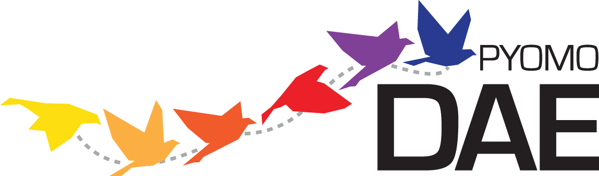

Dynamic Optimization with pyomo.DAE
===================================

The pyomo.DAE modeling extension allows users to incorporate systems of
differential algebraic equations (DAE)s in a Pyomo model. The modeling
components in this extension are able to represent ordinary or partial
differential equations. The differential equations do not have to be
written in a particular format and the components are flexible enough to
represent higher-order derivatives or mixed partial
derivatives. Pyomo.DAE also includes model transformations which use
simultaneous discretization approaches to transform a DAE model into an
algebraic model. Finally, pyomo.DAE includes utilities for simulating
DAE models and initializing dynamic optimization problems.

Modeling Components
-------------------

.. (Replace these definitions with in-code documentation)

Pyomo.DAE introduces three new modeling components to Pyomo:

.. autosummary::
   :nosignatures:

   pyomo.dae.ContinuousSet
   pyomo.dae.DerivativeVar
   pyomo.dae.Integral

As will be shown later, differential equations can be declared using
using these new modeling components along with the standard Pyomo
:py:class:`Var <pyomo.environ.Var>` and
:py:class:`Constraint <pyomo.environ.Constraint>` components.

ContinuousSet
*************

This component is used to define continuous bounded domains (for example
'spatial' or 'time' domains). It is similar to a Pyomo
:py:class:`Set <pyomo.environ.Set>`  component and can be used to index things
like variables and constraints. Any number of
:py:class:`ContinuousSets <pyomo.dae.ContinuousSet>`can be used to
index a component and components can be indexed by both
:py:class:`Sets <pyomo.environ.Set>` and
:py:class:`ContinuousSets <pyomo.dae.ContinuousSet>` in arbitrary order.

In the current implementation, models with
:py:class:`ContinuousSet<pyomo.dae.ContinuousSet>`components may not be solved
until every :py:class:`ContinuousSet<pyomo.dae.ContinuousSet>`has been
discretized. Minimally, a :py:class:`ContinuousSet<pyomo.dae.ContinuousSet>`
must be initialized with two numeric values representing the upper and lower
bounds of the continuous domain. A user may also specify additional points in
the domain to be used as finite element points in the discretization.

.. autoclass:: pyomo.dae.ContinuousSet
    :members:

The following code snippet shows examples of declaring a
:py:class:`ContinuousSet <pyomo.dae.ContinuousSet>` component on a
concrete Pyomo model:

.. code-block:: python

   # Required imports
   from pyomo.environ import *
   from pyomo.dae import *

   model = ConcreteModel()

   # declare by providing bounds
   model.t = ContinuousSet(bounds=(0,5))

   # declare by initializing with desired discretization points
   model.x = ContinuousSet(initialize=[0,1,2,5])

.. note::
   A :py:class:`ContinuousSet <pyomo.dae.ContinuousSet>` may not be
   constructed unless at least two numeric points are provided to bound the
   continuous domain.

The following code snippet shows an example of declaring a
:py:class:`ContinuousSet <pyomo.dae.ContinuousSet>` component on an
abstract Pyomo model using the example data file.

.. code-block:: ampl

   set t := 0 0.5 2.25 3.75 5;

.. code-block:: python

   # Required imports
   from pyomo.environ import *
   from pyomo.dae import *

   model = AbstractModel()

   # The ContinuousSet below will be initialized using the points
   # in the data file when a model instance is created.
   model.t = ContinuousSet()

.. note:: 
   If a separate data file is used to initialize a
   :py:class:`ContinuousSet <pyomo.dae.ContinuousSet>`, it is done using
   the 'set' command and not 'continuousset'

.. note::
   Most valid ways to declare and initialize a
   :py:class:`Set <pyomo.environ.Set>` can be used to
   declare and initialize a :py:class:`ContinuousSet<pyomo.dae.ContinuousSet>`.
   See the documentation for :py:class:`Set <pyomo.environ.Set>` for additional
   options.

.. warning:: 
   Be careful using a :py:class:`ContinuousSet
   <pyomo.dae.ContinuousSet>` as an implicit index in an expression,
   i.e. ``sum(m.v[i] for i in m.myContinuousSet)``. The expression will
   be generated using the discretization points contained in the
   :py:class:`ContinuousSet <pyomo.dae.ContinuousSet>` at the time the
   expression was constructed and will not be updated if additional
   points are added to the set during discretization.

.. note::
   :py:class:`ContinuousSet <pyomo.dae.ContinuousSet>` components are
   always ordered (sorted) therefore the ``first()`` and ``last()``
   :py:class:`Set <pyomo.environ.Set>` methods can be used to access the lower
   and upper boundaries of the
   :py:class:`ContinuousSet <pyomo.dae.ContinuousSet>` respectively
 
DerivativeVar
*************

.. autoclass:: pyomo.dae.DerivativeVar
    :members:

The code snippet below shows examples of declaring
:py:class:`DerivativeVar <pyomo.dae.DerivativeVar>` components on a
Pyomo model. In each case, the variable being differentiated is supplied
as the only positional argument and the type of derivative is specified
using the 'wrt' (or the more verbose 'withrespectto') keyword
argument. Any keyword argument that is valid for a Pyomo
:py:class:`Var <pyomo.environ.Var>` component may also be specified.

.. code-block:: python

   # Required imports
   from pyomo.environ import *
   from pyomo.dae import *

   model = ConcreteModel()
   model.s = Set(initialize=['a','b'])
   model.t = ContinuousSet(bounds=(0,5))
   model.l = ContinuousSet(bounds=(-10,10))

   model.x = Var(model.t)
   model.y = Var(model.s,model.t)
   model.z = Var(model.t,model.l)

   # Declare the first derivative of model.x with respect to model.t
   model.dxdt = DerivativeVar(model.x, withrespectto=model.t)

   # Declare the second derivative of model.y with respect to model.t
   # Note that this DerivativeVar will be indexed by both model.s and model.t
   model.dydt2 = DerivativeVar(model.y, wrt=(model.t,model.t))

   # Declare the partial derivative of model.z with respect to model.l
   # Note that this DerivativeVar will be indexed by both model.t and model.l
   model.dzdl = DerivativeVar(model.z, wrt=(model.l), initialize=0)

   # Declare the mixed second order partial derivative of model.z with respect
   # to model.t and model.l and set bounds
   model.dz2 = DerivativeVar(model.z, wrt=(model.t, model.l), bounds=(-10,10))

.. note:: 
   The 'initialize' keyword argument will initialize the value of a
   derivative and is **not** the same as specifying an initial
   condition. Initial or boundary conditions should be specified using a
   :py:class:`Constraint<pyomo.environ.Constraint>` or
   :py:class:`ConstraintList<pyomo.environ.ConstraintList>` or
   by fixing the value of a :py:class:`Var<pyomo.environ.Var>` at a boundary
   point.

Declaring Differential Equations
--------------------------------

A differential equations is declared as a standard Pyomo
:py:class:`Constraint<pyomo.environ.Constraint>` and is not required to have
any particular form. The following code snippet shows how one might declare
an ordinary or partial differential equation.

.. code-block:: python

   # Required imports
   from pyomo.environ import *
   from pyomo.dae import *

   model = ConcreteModel()
   model.s = Set(initialize=['a', 'b'])
   model.t = ContinuousSet(bounds=(0, 5))
   model.l = ContinuousSet(bounds=(-10, 10))

   model.x = Var(model.s, model.t)
   model.y = Var(model.t, model.l)
   model.dxdt = DerivativeVar(model.x, wrt=model.t)
   model.dydt = DerivativeVar(model.y, wrt=model.t)
   model.dydl2 = DerivativeVar(model.y, wrt=(model.l, model.l))

   # An ordinary differential equation
   def _ode_rule(m, s, t):
      if t == 0:
         return Constraint.Skip
      return m.dxdt[s, t] == m.x[s, t]**2
   model.ode = Constraint(model.s, model.t, rule=_ode_rule)

   # A partial differential equation
   def _pde_rule(m, t, l):
      if t == 0 or l == m.l.first() or l == m.l.last():
         return Constraint.Skip
      return m.dydt[t, l] == m.dydl2[t, l]
   model.pde = Constraint(model.t, model.l, rule=_pde_rule)

By default, a :py:class:`Constraint<pyomo.environ.Constraint>` declared over a
:py:class:`ContinuousSet<pyomo.dae.ContinuousSet>` will be applied at every
discretization point contained in the set. Often a modeler does not want to
enforce a differential equation at one or both boundaries of a continuous
domain. This may be addressed explicitly in the
:py:class:`Constraint<pyomo.environ.Constraint>` declaration using
``Constraint.Skip`` as shown above. Alternatively, the desired constraints can
be deactivated just before the model is sent to a solver as shown below.

.. code-block:: python

   def _ode_rule(m, s, t):
      return m.dxdt[s, t] == m.x[s, t]**2
   model.ode = Constraint(model.s, model.t, rule=_ode_rule)

   def _pde_rule(m, t, l):
      return m.dydt[t, l] == m.dydl2[t, l]
   model.pde = Constraint(model.t, model.l, rule=_pde_rule)

   # Declare other model components and apply a discretization transformation
   ...

   # Deactivate the differential equations at certain boundary points
   for con in model.ode[:, model.t.first()]:
      con.deactivate()

   for con in model.pde[0, :]:
      con.deactivate()

   for con in model.pde[:, model.l.first()]:
      con.deactivate()

   for con in model.pde[:, model.l.last()]:
      con.deactivate()

   # Solve the model
   ...

.. note::
   If you intend to use the pyomo.DAE
   :py:class:`Simulator<pyomo.dae.simulator>` on your model then you
   **must** use **constraint deactivation** instead of **constraint
   skipping** in the differential equation rule.

Declaring Integrals
-------------------

.. warning::
   The :py:class:`Integral<pyomo.dae.Integral>` component is still under
   development and considered a prototype. It currently includes only basic
   functionality for simple integrals. We welcome feedback on the interface
   and functionality but **we do not recommend using it** on general
   models. Instead, integrals should be reformulated as differential
   equations.

.. autoclass:: pyomo.dae.Integral
   :members:

Declaring an :py:class:`Integral<pyomo.dae.Integral>` component is similar to
declaring an :py:class:`Expression<pyomo.environ.Expression>` component. A
simple example is shown below:

.. code-block:: python

   model = ConcreteModel()
   model.time = ContinuousSet(bounds=(0,10))
   model.X = Var(model.time)
   model.scale = Param(initialize=1E-3)

   def _intX(m,t):
      return X[t]
   model.intX = Integral(model.time,wrt=model.time,rule=_intX)

   def _obj(m):
      return m.scale*m.intX
   model.obj = Objective(rule=_obj)

Notice that the positional arguments supplied to the
:py:class:`Integral<pyomo.dae.Integral>` declaration must include all indices
needed to evaluate the integral expression. The integral expression is defined
in a function and supplied to the 'rule' keyword argument. Finally, a user must
specify a :py:class:`ContinuousSet<pyomo.dae.ContinuousSet>` that the integral
is being evaluated over. This is done using the 'wrt' keyword argument.

.. note:: 
   The :py:class:`ContinuousSet<pyomo.dae.ContinuousSet>` specified using the
   'wrt' keyword argument must be explicitly specified as one of the indexing
   sets (meaning it must be supplied as a positional argument). This is to
   ensure consistency in the ordering and dimension of the indexing sets

After an :py:class:`Integral<pyomo.dae.Integral>` has been declared, it can be
used just like a Pyomo :py:class:`Expression<pyomo.environ.Expression>`
component and can be included in constraints or the objective function as shown
above.

If an :py:class:`Integral<pyomo.dae.Integral>` is specified with multiple
positional arguments, i.e. multiple indexing sets, the final component will be
indexed by all of those sets except for the
:py:class:`ContinuousSet<pyomo.dae.ContinuousSet>` that the integral was
taken over. In other words, the
:py:class:`ContinuousSet<pyomo.dae.ContinuousSet>` specified with the
'wrt' keyword argument is removed from the indexing sets of the
:py:class:`Integral<pyomo.dae.Integral>` even though it must be specified as a
positional argument. This should become more clear with the following example
showing a double integral over the
:py:class:`ContinuousSet<pyomo.dae.ContinuousSet>` components ``model.t1`` and
``model.t2``. In addition, the expression is also indexed by the
:py:class:`Set<pyomo.environ.Set>` ``model.s``. The mathematical representation
and implementation in Pyomo are shown below:

.. math::
   \sum_{s} \int_{t_2} \int_{t_1} \! X(t_1, t_2, s) \, dt_1 \, dt_2

.. code-block:: python

   model = ConcreteModel()
   model.t1 = ContinuousSet(bounds=(0, 10))
   model.t2 = ContinuousSet(bounds=(-1, 1))
   model.s = Set(initialize=['A', 'B', 'C'])

   model.X = Var(model.t1, model.t2, model.s)

   def _intX1(m, t1, t2, s):
      return m.X[t1, t2, s]
   model.intX1 = Integral(model.t1, model.t2, model.s, wrt=model.t1,
                          rule=_intX1)

   def _intX2(m, t2, s):
      return m.intX1[t2, s]
   model.intX2 = Integral(model.t2, model.s, wrt=model.t2, rule=_intX2)

   def _obj(m):
      return sum(model.intX2[k] for k in m.s)
   model.obj = Objective(rule=_obj)

Discretization Transformations
------------------------------

Before a Pyomo model with ``DerivativeVar`` or ``Integral`` components
can be sent to a solver it must first be sent through a discretization
transformation. These transformations approximate any derivatives or
integrals in the model by using a numerical method. The numerical
methods currently included in this tool discretize the continuous
domains in the problem and introduce equality constraints which
approximate the derivatives and integrals at the discretization
points. Two families of discretization schemes have been implemented in
Pyomo, Finite Difference and Collocation. These schemes are described in
more detail below.

.. note:: 
   The schemes described here are for derivatives only. All
   integrals will be transformed using the trapezoid rule.

The user must write a Python script in order to use these
discretizations, they have not been tested on the pyomo command
line. Example scripts are shown below for each of the discretization
schemes. The transformations are applied to Pyomo model objects which
can be further manipulated before being sent to a solver. Examples of
this are also shown below.

Finite Difference Transformation
********************************

This transformation includes implementations of several finite
difference methods. For example, the Backward Difference method (also
called Implicit or Backward Euler) has been implemented. The
discretization equations for this method are shown below:

.. math::
   \begin{array}{l}
   \mathrm{Given } dx/dt = f(t,x) \mathrm{ and } x(t0) = x_{0} \\
   \mathrm{discretize } t \mathrm{ and } x \mathrm{ such that} \\
   x(t0+kh)= x_{k} \\
   x_{k+1}= x_{k}+h*f(t_{k+1},x_{k+1}) \\
   t_{k+1}= t_{k}+h
   \end{array}

where :math:`h` is the step size between discretization points
or the size of each finite element. These equations are generated
automatically as +Constraint+ components when the backward
difference method is applied to a Pyomo model.

There are several discretization options available to a
+dae.finite_difference+ transformation which can be specified as
keyword arguments to the .apply_to() function of the transformation
object. These keywords are summarized below:

.. Replace this with in-code documentation

Keyword arguments for applying a finite difference transformation:

'nfe': The desired number of finite element points to be included in the
discretization. The default value is 10.

'wrt': Indicates which ``ContinuousSet`` the transformation should be
applied to. If this keyword argument is not specified then the same
scheme will be applied to every ``ContinuousSet``.

'scheme': Indicates which finite difference method to apply. Options are
'BACKWARD', 'CENTRAL', or 'FORWARD'. The default scheme is the backward
difference method.

If the existing number of finite element points in a ``ContinuousSet``
is less than the desired number, new discretization points will be
added to the set. If a user specifies a number of finite element
points which is less than the number of points already included in the
``ContinuousSet`` then the transformation will ignore the specified
number and proceed with the larger set of points. Discretization points
will never be removed from a ``ContinousSet`` during the discretization.

The following code is a Python script applying the backward difference
method. The code also shows how to add a constraint to a discretized
model.

.. code-block:: python

   from pyomo.environ import *
   from pyomo.dae import *

   # Import concrete Pyomo model
   from pyomoExample import model

   # Discretize model using Backward Difference method
   discretizer = TransformationFactory('dae.finite_difference')
   discretizer.apply_to(model,nfe=20,wrt=model.time,scheme='BACKWARD')

   # Add another constraint to discretized model
   def _sum_limit(m):
      return sum(m.x1[i] for i in m.time) <= 50
   model.con_sum_limit = Constraint(rule=_sum_limit)

   # Solve discretized model
   solver = SolverFactory('ipopt')
   results = solver.solve(model)

Collocation Transformation
**************************

This transformation uses orthogonal collocation to discretize the
differential equations in the model. Currently, two types of
collocation have been implemented. They both use Lagrange polynomials
with either Gauss-Radau roots or Gauss-Legendre roots. For more
information on orthogonal collocation and the discretization equations
associated with this method please see chapter 10 of the book
"Nonlinear Programming: Concepts, Algorithms, and Applications to
Chemical Processes" by L.T. Biegler.

The discretization options available to a
``dae.collocation`` transformation are the same as those
described above for the finite difference transformation with
different available schemes and the addition of the 'ncp' option.

.. Replace with in-code documentation

Additional keyword arguments for collocation discretizations:

'scheme': The desired collocation scheme, either 'LAGRANGE-RADAU' or
'LAGRANGE-LEGENDRE'. The default is 'LAGRANGE-RADAU'.

'ncp': The number of collocation points within each finite element. The
default value is 3.

.. note:: 
   If the user's version of Python has access to the package Numpy
   then any number of collocation points may be specified, otherwise the
   maximum number is 10.

.. note::
   Any points that exist in a ``ContinuousSet`` before discretization
   will be used as finite element boundaries and not as collocation
   points. The locations of the collocation points cannot be specified
   by the user, they must be generated by the transformation.

The following code is a Python script applying collocation with
Lagrange polynomials and Radau roots. The code also shows how to add
an objective function to a discretized model.

.. code-block:: python

   from pyomo.environ import *
   from pyomo.dae import *

   # Import concrete Pyomo model
   from pyomoExample2 import model

   # Discretize model using Radau Collocation
   discretizer = TransformationFactory('dae.collocation')
   discretizer.apply_to(model,nfe=20,ncp=6,scheme='LAGRANGE-RADAU')

   # Add objective function after model has been discretized
   def obj_rule(m):
      return sum((m.x[i]-m.x_ref)**2 for i in m.time)
   model.obj = Objective(rule=obj_rule)

   # Solve discretized model
   solver = SolverFactory('ipopt')
   results = solver.solve(model)

Piecewise Constant Optimal Control Profiles
^^^^^^^^^^^^^^^^^^^^^^^^^^^^^^^^^^^^^^^^^^^ 

Describe the reduce_collocation_points method, include figures showing
the difference in profiles

Applying Multiple Discretization Transformations
************************************************

Discretizations can be applied independently to each ``ContinuousSet``
in a model. This allows the user great flexibility in discretizing
their model. For example the same numerical method can be applied with
different resolutions:

.. code-block:: python

   discretizer = TransformationFactory('dae.finite_difference')
   discretizer.apply_to(model,wrt=model.t1,nfe=10)
   discretizer.apply_to(model,wrt=model.t2,nfe=100)

This also allows the user to combine different methods. For example,
applying the forward difference method to one ``ContinuousSet`` and the
central finite difference method to another ``ContinuousSet``:

.. code-block:: python

   discretizer = TransformationFactory('dae.finite_difference')
   discretizer.apply_to(model,wrt=model.t1,scheme='FORWARD')
   discretizer.apply_to(model,wrt=model.t2,scheme='CENTRAL')

In addition, the user may combine finite difference and collocation
discretizations. For example:

.. code-block:: python

   disc_fe = TransformationFactory('dae.finite_difference')
   disc_fe.apply_to(model,wrt=model.t1,nfe=10)
   disc_col = TransformationFactory('dae.collocation')
   disc_col.apply_to(model,wrt=model.t2,nfe=10,ncp=5)

If the user would like to apply the same discretization to all
``ContinuousSet`` components in a model, just specify the discretization
once without the 'wrt' keyword argument. This will apply that scheme
to all ``ContinuousSet`` components in the model that haven't already been
discretized.

Custom Discretization Schemes
*****************************

A transformation framework along with certain utility functions has
been created so that advanced users may easily implement custom
discretization schemes other than those listed above. The
transformation framework consists of the following steps:

   1. Specify Discretization Options
   2. Discretize the ContinuousSet(s)
   3. Update Model Components
   4. Add Discretization Equations
   5. Return Discretized Model

If a user would like to create a custom finite difference scheme then
they only have to worry about step (4) in the framework. The
discretization equations for a particular scheme have been isolated
from of the rest of the code for implementing the transformation. The
function containing these discretization equations can be found at the
top of the source code file for the transformation. For example, below
is the function for the forward difference method:

.. code-block:: python

   def _forward_transform(v,s):
   """
   Applies the Forward Difference formula of order O(h) for first derivatives
   """
      def _fwd_fun(i):
         tmp = sorted(s)
         idx = tmp.index(i)
         return 1/(tmp[idx+1]-tmp[idx])*(v(tmp[idx+1])-v(tmp[idx]))
      return _fwd_fun

In this function, 'v' represents the continuous variable or function
that the method is being applied to. 's' represents the set of
discrete points in the continuous domain. In order to implement a
custom finite difference method, a user would have to copy the above
function and just replace the equation next to the first return
statement with their method.

After implementing a custom finite difference method using the above
function template, the only other change that must be made is to add
the custom method to the 'all_schemes' dictionary in the
Finite_Difference_Transformation class. 

In the case of a custom collocation method, changes will have to be
made in steps (2) and (4) of the transformation framework. In addition
to implementing the discretization equations, the user would also have
to ensure that the desired collocation points are added to the
ContinuousSet being discretized.

Dynamic Model Simulation
------------------------

Available Simulators
********************

Specifying Time-Varing Inputs
*****************************

Dynamic Model Initialization
----------------------------

From Simulation
***************

Examples
--------
