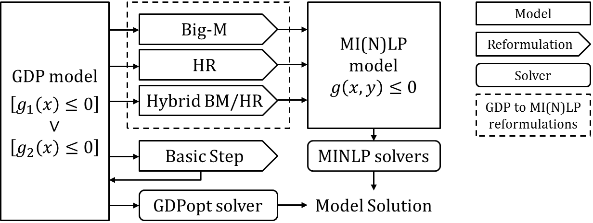

***********************************
Generalized Disjunctive Programming
***********************************

.. image:: /../logos/gdp/Pyomo-GDP-150.png
   :scale: 35%
   :align: right

The Pyomo.GDP modeling extension provides support for Generalized Disjunctive Programming (GDP) [#gdp]_, an extension of Disjunctive Programming [#dp]_ from the operations research community to include nonlinear relationships. The classic form for a GDP is given by:

.. math::

    \begin{aligned}
    \min\ obj = &\ f(x, z) \\
    \text{s.t.} \quad &\ Ax+Bz \leq d\\
    &\ g(x,z) \leq 0\\
    &\ \bigvee_{i\in D_k} \left[
        \begin{gathered}
        Y_{ik} \\
        M_{ik} x + N_{ik} z \leq e_{ik} \\
        r_{ik}(x,z)\leq 0\\
        \end{gathered}
    \right] \quad k \in K\\
    &\ \Omega(Y) = True \\
    &\ x \in X \subseteq \mathbb{R}^n\\
    &\ Y \in \{True, False\}^{p}\\
    &\ z \in Z \subseteq \mathbb{Z}^m\\
    \end{aligned}

Here, we have the minimization of an objective :math:`obj` subject to global linear constraints :math:`Ax+Bz \leq d` and nonlinear constraints :math:`g(x,z) \leq 0`, with conditional linear constraints :math:`M_{ik} x + N_{ik} z \leq e_{ik}` and nonlinear constraints :math:`r_{ik}(x,z)\leq 0`.
These conditional constraints are collected into disjuncts :math:`D_k`, organized into disjunctions :math:`K`. Finally, there are logical propositions :math:`\Omega(Y) = True`.
Decision/state variables can be continuous :math:`x`, Boolean :math:`Y`, and/or integer :math:`z`.

GDP is useful to model discrete decisions that have implications on the system behavior.
For example, in process design, a disjunction may model the choice between processes A and B.
If A is selected, then its associated equations and inequalities will apply; otherwise, if B is selected, then its respective constraints should be enforced.

Disjuncts
=========

Disjuncts represent groupings of relational expressions (e.g. algebraic constraints) summarized by a Boolean indicator variable $Y$ through implication:

.. math::

    \left.
    \begin{aligned}
    & Y_{ik} \Rightarrow & M_{ik} x + N_{ik} z &\leq e_{ik}\\
    & Y_{ik} \Rightarrow & r_{ik}(x,z) &\leq 0
    \end{aligned}
    \right.\qquad \forall i \in D_k, \forall k \in K

Logically, this means that if :math:`Y_{ik} = True`, then the constraints :math:`M_{ik} x + N_{ik} z \leq e_{ik}` and :math:`r_{ik}(x,z) \leq 0` must be satisfied.
However, if :math:`Y_{ik} = False`, then the corresponding constraints are ignored.
Note that :math:`Y_{ik} = False` does **not** imply that the corresponding constraints are *violated*.

Disjunctions
============

Disjunctions describe a logical *OR* relationship between two or more Disjuncts.
The simplest and most common case is a 2-term disjunction:

.. math::

    \left[\begin{gathered}
    Y_1 \\
    \exp(x_2) - 1 = x_1 \\
    x_3 = x_4 = 0
    \end{gathered}
    \right] \bigvee \left[\begin{gathered}
    Y_2 \\
    \exp\left(\frac{x_4}{1.2}\right) - 1 = x_3 \\
    x_1 = x_2 = 0
    \end{gathered}
    \right]

The disjunction above describes the selection between two units in a process network.
:math:`Y_1` and :math:`Y_2` are the Boolean variables corresponding to the selection of process units 1 and 2, respectively.
The continuous variables :math:`x_1, x_2, x_3, x_4` describe flow in and out of the first and second units, respectively.
If a unit is selected, the nonlinear equality in the corresponding disjunct enforces the input/output relationship in the selected unit.
The final equality in each disjunct forces flows for the absent unit to zero.

Expanded syntax: more descriptive
---------------------------------

Pyomo.GDP expanded syntax (see below) provides more clarity in the declaration of each modeling object.
Assuming the ``ConcreteModel`` object :code:`m` and variables have been defined, lines 1 and 5 declare the ``Disjunct`` objects corresponding to selection of unit 1 and 2, respectively.
Lines 2 and 6 define the input-output relations for each unit, and lines 3-4 and 7-8 enforce zero flow through the unit that is not selected.
Finally, line 9 declares the logical disjunction between the two disjunctive terms.

.. code-block:: python
    :linenos:

    m.unit1 = Disjunct()
    m.unit1.inout = Constraint(expr=exp(m.x[2]) - 1 == m.x[1])
    m.unit1.no_unit2_flow1 = Constraint(expr=m.x[3] == 0)
    m.unit1.no_unit2_flow2 = Constraint(expr=m.x[4] == 0)
    m.unit2 = Disjunct()
    m.unit2.inout = Constraint(expr=exp(m.x[4] / 1.2) - 1 == m.x[3])
    m.unit2.no_unit1_flow1 = Constraint(expr=m.x[1] == 0)
    m.unit2.no_unit1_flow2 = Constraint(expr=m.x[2] == 0)
    m.use_unit1or2 = Disjunction(expr=[m.unit1, m.unit2])

The indicator variables for each disjunct :math:`Y_1` and :math:`Y_2` are automatically generated by Pyomo.GDP, accessible via :code:`m.unit1.indicator_var` and :code:`m.unit2.indicator_var`.

Compact syntax: more concise
----------------------------

For more advanced users, a compact syntax is also available below, taking advantage of the ability to declare disjuncts and constraints implicitly.
When the ``Disjunction`` object constructor is passed a list of lists, the outer list defines the disjuncts and the inner list defines the constraint expressions associated with the respective disjunct.

.. code-block:: python
    :linenos:

    m.use1or2 = Disjunction(expr=[
        # First disjunct
        [exp(m.x[3])-1 == m.x[2],
         m.x[4] == 0, m.x[5] == 0],
        # Second disjunct
        [exp(m.x[5]/1.2)-1 == m.x[4],
         m.x[2] == 0, m.x[3] == 0]])

.. note::

    By default, Pyomo.GDP ``Disjunction`` objects enforce an implicit "exactly one" relationship among the selection of the disjuncts (generalization of exclusive-OR).
    That is, exactly one of the ``Disjunct`` indicator variables should take a ``True`` value.

Logical Propositions
====================

Pyomo.GDP also supports the use of logical propositions through the use of the ``BooleanVar`` and ``LogicalConstraint`` objects.
The ``BooleanVar`` object in Pyomo represents Boolean variables, analogous to ``Var`` for numeric variables.
``BooleanVar`` can be indexed over a Pyomo ``Set``, as below:

.. testsetup::

    from pyomo.environ import ConcreteModel, RangeSet, BooleanVar, LogicalConstraint, AtLeast

.. doctest::

    >>> m = ConcreteModel()
    >>> m.my_set = RangeSet(4)
    >>> m.Y = BooleanVar(m.my_set)
    >>> m.Y.display()
    Y : Size=4, Index=my_set
        Key : Value : Fixed : Stale
          1 :  None : False :  True
          2 :  None : False :  True
          3 :  None : False :  True
          4 :  None : False :  True

.. note::

    For historical reasons, the ``indicator_var`` variable automatically added to disjuncts in Pyomo.GDP has type ``binary`` rather than ``Boolean``.
    This may be corrected in the future.

Using these Boolean variables, we can define ``LogicalConstraint`` objects, analogous to numeric ``Constraint`` objects.

.. doctest::

    >>> m.p = LogicalConstraint(expr=m.Y[1].implies(m.Y[2] & m.Y[3]) | m.Y[4])
    >>> m.p.pprint()
    p : Size=1, Index=None, Active=True
        Key  : Body                         : Active
        None : Y[1] >> (Y[2] & Y[3]) | Y[4] :   True

Supported Logical Operators
---------------------------

Pyomo.GDP logical expression system supported operators and their usage are listed in the table below.

+--------------+----------------------+-----------------------------------+--------------------------------+
| Operator     | Infix                | Method                            | Function                       |
+==============+======================+===================================+================================+
| Conjunction  | :code:`Y[1] & Y[2]`  | :code:`Y[1].and_(Y[2])`           | :code:`And(Y[1],Y[2])`         |
+--------------+----------------------+-----------------------------------+--------------------------------+
|              |                      |                                   |                                |
| Disjunction  | :code:`Y[1] | Y[2]`  | :code:`Y[1].or_(Y[2])`            | :code:`Or(Y[1],Y[2])`          |
+--------------+----------------------+-----------------------------------+--------------------------------+
|              |                      |                                   |                                |
| Negation     | :code:`~Y[1]`        |                                   | :code:`Not(Y[1])`              |
+--------------+----------------------+-----------------------------------+--------------------------------+
|              |                      |                                   |                                |
| Exclusive OR | :code:`Y[1] ^ Y[2]`  | :code:`Y[1].xor(Y[2])`            | :code:`Xor(Y[1], Y[2])`        |
+--------------+----------------------+-----------------------------------+--------------------------------+
|              |                      |                                   |                                |
| Implication  | :code:`Y[1] >> Y[2]` | :code:`Y[1].implies(Y[2])`        | :code:`Implies(Y[1], Y[2])`    |
|              |                      |                                   |                                |
|              | :code:`Y[2] << Y[1]` |                                   |                                |
+--------------+----------------------+-----------------------------------+--------------------------------+
|              |                      |                                   |                                |
| Equivalence  | :code:`Y[1] == Y[2]` | :code:`Y[1].equivalent_to(Y[2])`  | :code:`Equivalent(Y[1], Y[2])` |
+--------------+----------------------+-----------------------------------+--------------------------------+

In addition, the following constraint programming inspired operators are provided: ``Exactly``, ``AtMost``, and ``AtLeast``.
These predicates enforce, respectively, that exactly, at most, or at least N of their ``BooleanVar`` arguments are ``True``.

Usage:

- :code:`AtLeast(3, Y[1], Y[2], Y[3])`
- :code:`AtMost(3, Y)`
- :code:`Exactly(3, Y)`

.. doctest::

    >>> m = ConcreteModel()
    >>> m.my_set = RangeSet(4)
    >>> m.Y = BooleanVar(m.my_set)
    >>> m.p = LogicalConstraint(expr=AtLeast(3, m.Y))
    >>> TransformationFactory('core.logical_to_linear').apply_to(m)
    >>> m.logic_to_linear.pprint()  # constraint auto-generated by transformation
    >>> m.p.pprint()
    logic_to_linear : Size=1, Index=logic_to_linear_index, Active=True
        Key : Lower : Body                                                          : Upper : Active
          1 :   3.0 : Y_asbinary[1] + Y_asbinary[2] + Y_asbinary[3] + Y_asbinary[4] :  +Inf :   True
    p : Size=1, Index=None, Active=False
        Key  : Body                                 : Active
        None : AtLeast(3: [Y[1], Y[2], Y[3], Y[4]]) :  False

Advanced Use
------------

Support for complex nested expressions is a key benefit of the logical expression system.
Below are examples of expressions that we support, and with some, an explanation of their implementation.

.. note::

    When using infix operators (e.g. `&` for `and`, `|` for `or`, `>>` for `implies`), exercise caution around order-of-operations.
    We recommend that the user **use parentheses**.
    Code that reads :code:`m.Y[1] & m.Y[2] | m.Y[3]` can be ambiguous, because :math:`(Y_1 \wedge Y_2) \vee Y_3` is different from :math:`Y_1 \wedge (Y_2 \vee Y_3)`.
    :code:`(m.Y[1] & m.Y[2]) | m.Y[3]` is unambiguous.
    This is particularly important for implication, since in Python, the bitwise shift operator (`>>`) that we borrow for implication binds more strongly than you may expect.

Composition of standard operators
^^^^^^^^^^^^^^^^^^^^^^^^^^^^^^^^^

.. math::
    Y_1 \vee Y_2 \implies Y_3 \wedge \neg Y_4 \wedge (Y_5 \vee Y_6)

.. code::

    m.p = LogicalConstraint(expr=(m.Y[1] | m.Y[2]) >> (m.Y[3] & ~m.Y[4] & (m.Y[5] | m.Y[6])))

Expressions within CP-type operators
^^^^^^^^^^^^^^^^^^^^^^^^^^^^^^^^^^^^

.. math::
    \text{AtLeast}(3, Y_1, Y_2 \vee Y_3, Y_4 \Rightarrow Y_5, Y_6)

Here, augmented variables may be automatically added to the model as follows:

.. math::
    \text{AtLeast}(3, &Y_1, Y_A, Y_B, Y_6)\\
    &Y_A \Leftrightarrow Y_2 \vee Y_3\\
    &Y_B \Leftrightarrow (Y_4 \Rightarrow Y_5)

.. code::

    m.p = LogicalConstraint(
        expr=AtLeast(3, m.Y[1], m.Y[2] | m.Y[3], m.Y[4].implies(m.Y[5]), m.Y[6]))

Nested CP-style operators
^^^^^^^^^^^^^^^^^^^^^^^^^

.. math::
    \text{AtLeast}(2, Y_1, \text{Exactly}(2, Y_2, Y_3, Y_4), Y_5, Y_6)

Here, we again need to add augmented variables:

.. math::
    \text{AtLeast}(2, Y_1, Y_A, Y_5, Y_6)\\
    Y_A \Leftrightarrow \text{Exactly}(2, Y_2, Y_3, Y_4)

However, we also need to further interpret the second statement as a disjunction:

.. math::
    \text{AtLeast}(2, Y_1, Y_A, Y_5, Y_6)

    \left[\begin{gathered}Y_A\\\text{Exactly}(2, Y_2, Y_3, Y_4)\end{gathered}\right]
    \vee
    \left[\begin{gathered}\neg Y_A\\
    \left[\begin{gathered}Y_B\\\text{AtLeast}(3, Y_2, Y_3, Y_4)\end{gathered}\right] \vee \left[\begin{gathered}Y_C\\\text{AtMost}(1, Y_2, Y_3, Y_4)\end{gathered}\right]
    \end{gathered}\right]

or equivalently,

.. math::
    \text{AtLeast}(2, Y_1, Y_A, Y_5, Y_6)

    \text{Exactly}(1, Y_A, Y_B, Y_C)

    \left[\begin{gathered}Y_A\\\text{Exactly}(2, Y_2, Y_3, Y_4)\end{gathered}\right]
    \vee
    \left[\begin{gathered}Y_B\\\text{AtLeast}(3, Y_2, Y_3, Y_4)\end{gathered}\right] \vee \left[\begin{gathered}Y_C\\\text{AtMost}(1, Y_2, Y_3, Y_4)\end{gathered}\right]

In our transformation (see below), we automatically convert these special disjunctions to linear form using a Big M reformulation.

Solving GDP Models
==================

Once a model is formulated as a GDP model, a range of solution strategies are available to manipulate and solve it.

    GDP solution approaches. Image from literature [#gdppsepaper]_.

The traditional approach is reformulation to MINLP, but direct solution via GDPopt is also possible.

Reformulation to MI(N)LP
------------------------

To use standard commercial solvers, you must convert the disjunctive model to a standard MIP/MINLP model.
The two classical strategies for doing so are the (included) Big-M and Hull reformulations.
From the Pyomo command line,  include the option ``--transform pyomo.gdp.bigm`` or ``--transform pyomo.gdp.hull``.
If you are using a Python script, ``TransformationFactory`` accomplishes the same functionality:

- ``TransformationFactory('gdp.bigm').apply_to(model)``
- ``TransformationFactory('gdp.hull').apply_to(model)``

.. note::

    - all variables that appear in disjuncts need upper and lower bounds for hull

    - for linear models, the BigM transform can estimate reasonably tight M
      values for you if variables are bounded.

    - for nonlinear models where finite expression bounds may be inferred from
      variable bounds, the BigM transformation may also be able to automatically
      compute M values for you.

    - for all other models, you will need to provide the M values through a
      “BigM” Suffix. A ``GDP_Error`` will be raised for missing M values.

    - When you declare a Disjunct, it (at declaration time) will automatically
      have a variable “indicator_var” defined and attached to it.
      After that, it is just a Var like any other Var.

    - The hull reformulation is an exact reformulation at the solution points
      even for nonconvex models, but the resulting MINLP will also be nonconvex.

Direct GDP solvers
------------------

Pyomo includes the contributed GDPopt solver, which can direct solve GDP models.
Its documentation and usage is described at :doc:`/contributed_packages/gdpopt`.

Examples
========

The following models all work and are equivalent:

.. doctest::
   
   Option 1: maximal verbosity, abstract-like

   >>> from pyomo.environ import *
   >>> from pyomo.gdp import *
   >>> model = ConcreteModel()

   >>> model.x = Var()
   >>> model.y = Var()

   >>> # Two conditions
   >>> def _d(disjunct, flag):
   ...    model = disjunct.model()
   ...    if flag:
   ...       # x == 0
   ...       disjunct.c = Constraint(expr=model.x == 0)
   ...    else:
   ...       # y == 0
   ...       disjunct.c = Constraint(expr=model.y == 0)
   >>> model.d = Disjunct([0,1], rule=_d)
 
   >>> # Define the disjunction
   >>> def _c(model):
   ...    return [model.d[0], model.d[1]]
   >>> model.c = Disjunction(rule=_c) 

   Option 2: Maximal verbosity, concrete-like:

   >>> from pyomo.environ import *
   >>> from pyomo.gdp import *
   >>> model = ConcreteModel()
 
   >>> model.x = Var()
   >>> model.y = Var()
 
   >>> model.fix_x = Disjunct()
   >>> model.fix_x.c = Constraint(expr=model.x == 0)
 
   >>> model.fix_y = Disjunct()
   >>> model.fix_y.c = Constraint(expr=model.y == 0)
 
   >>> model.c = Disjunction(expr=[model.fix_x, model.fix_y])
 
   Option 3: Implicit disjuncts (disjunction rule returns a list of
   expressions or a list of lists of expressions)
 
   >>> from pyomo.environ import *
   >>> from pyomo.gdp import *
   >>> model = ConcreteModel()
 
   >>> model.x = Var()
   >>> model.y = Var()

   >>> model.c = Disjunction(expr=[model.x == 0, model.y == 0])

.. [#gdp] Raman, R., & Grossmann, I. E. (1994). Modelling and computational techniques for logic based integer programming. *Computers & Chemical Engineering*, 18(7), 563–578. https://doi.org/10.1016/0098-1354(93)E0010-7

.. [#dp] Balas, E. (1985). Disjunctive Programming and a Hierarchy of Relaxations for Discrete Optimization Problems. *SIAM Journal on Algebraic Discrete Methods*, 6(3), 466–486. https://doi.org/10.1137/0606047

.. [#gdppsepaper] Chen, Q., Johnson, E. S., Siirola, J. D., & Grossmann, I. E. (2018). Pyomo.GDP: Disjunctive Models in Python. In M. R. Eden, M. G. Ierapetritou, & G. P. Towler (Eds.), *Proceedings of the 13th International Symposium on Process Systems Engineering* (pp. 889–894). San Diego: Elsevier B.V. https://doi.org/10.1016/B978-0-444-64241-7.50143-9
