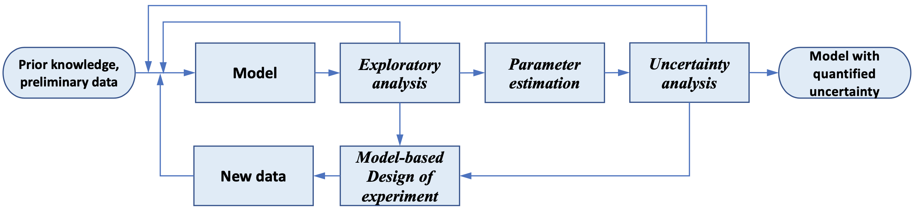

############
Pyomo.DOE
############

Pyomo.DOE
===================================

**Pyomo.DOE** (Pyomo Design of Experiments) is a Python library for model-based design of experiments
using science-based models.

It was developed by **Jialu Wang** and **Alexander W. Dowling** of University of Notre Dame. The developers gratefully
acknowledge support from [TODO: acknowledgement].

Methodology Overview
---------------------

Model-based Design of Experiments (MBDoE) is a technique numerically maximizing the information gain of experiments by directly using
science-based models with physically meaningful parameters. It is one key component in the model calibration and uncertainty quantification workflow
shown below:

   The exploratory analysis, parameter estimation, uncertainty analysis, and MBDoE are combined into an iterative framework to select, refine, and calibrate science-based mathematical models with quantified uncertainty.

Pyomo.DOE provides the exploratory anlaysis and MBDoE given one Pyomo model, a set of parameter nominal values,
the allowable design spaces for design variables, and the assumed observation error model.
The exploratory analysis checks if this model parameters can be inferred from the postulated measurements or preliminary data.
MBDoE generates new experiments for collecting more data.
The goal of this workflow is to achieve a confident parameter estimation.
Parameter estimation packages such as **Parmest** can perform parameter estimation using the available data to infer values for parameters,
and facilitate an uncertainty analysis to approximate the parameter covariance matrix.
If the parameter uncertainties are sufficiently small, the workflow terminates and returns the final model with quantified parametric uncertainty.
If not, MBDoE is performed to generate new experiments and new data.

Below is an overview of the type of optimization models Pyomo.DOE can accomodate:

* Pyomo.DOE is suitable for optimization models of **continuous** variables
* Pyomo.DOE can handle **equality constraints** defining state variables
* Pyomo.DOE allows for (Partial) Differential-Algebraic Equations (DAE) models which can be discretized and solved by Pyomo.DAE, and also just algebraic models

The general form of a DAE problem that can be passed into Pyomo.DOE is shown below:

.. math::
    \begin{align*}
        & \dot{\mathbf{x}}(t) = \mathbf{f}(\mathbf{x}(t), \mathbf{z}(t), \mathbf{y}(t), \mathbf{u}(t), \overline{\mathbf{w}}, \boldsymbol{\theta}) \\
        & \mathbf{g}(\mathbf{x}(t),  \mathbf{z}(t), \mathbf{y}(t), \mathbf{u}(t), \overline{\mathbf{w}},\boldsymbol{\theta})=\mathbf{0} \\
        & \mathbf{y} =\mathbf{h}(\mathbf{x}(t), \mathbf{z}(t), \mathbf{u}(t), \overline{\mathbf{w}},\boldsymbol{\theta}) \\
        & \mathbf{f}^{\mathbf{0}}\left(\dot{\mathbf{x}}\left(t_{0}\right), \mathbf{x}\left(t_{0}\right), \mathbf{z}(t_0), \mathbf{y}(t_0), \mathbf{u}\left(t_{0}\right), \overline{\mathbf{w}}, \boldsymbol{\theta})\right)=\mathbf{0} \\
        & \mathbf{g}^{\mathbf{0}}\left( \mathbf{x}\left(t_{0}\right),\mathbf{z}(t_0), \mathbf{y}(t_0), \mathbf{u}\left(t_{0}\right), \overline{\mathbf{w}}, \boldsymbol{\theta}\right)=\mathbf{0}\\
        &\mathbf{y}^{\mathbf{0}}\left(t_{0}\right)=\mathbf{h}\left(\mathbf{x}\left(t_{0}\right),\mathbf{z}(t_0), \mathbf{u}\left(t_{0}\right), \overline{\mathbf{w}}, \boldsymbol{\theta}\right)
    \end{align*}

where:

*  :math:`\boldsymbol{\theta} \in \mathbb{R}^{N_p}` are unknown model parameters.
*  :math:`\mathbf{x} \subseteq \mathcal{X}` are dynamic state variables which characterize trajectory of the system, :math:`\mathcal{X} \in \mathbb{R}^{N_x \times N_t}`.
*  :math:`\mathbf{z} \subseteq \mathcal{Z}` are algebraic state variables, :math:`\mathcal{Z} \in \mathbb{R}^{N_z \times N_t}`.
*  :math:`\mathbf{u} \subseteq \mathcal{U}` are time-varying decision variables,  :math:`\mathcal{U} \in \mathbb{R}^{N_u \times N_t}`.
*  :math:`\overline{\mathbf{w}} \in \mathbb{R}^{N_w}` are time-invariant decision variables.
*  :math:`\mathbf{y} \subseteq \mathcal{Y}` are measurement response variables,   :math:`\mathcal{Y} \in \mathbb{R}^{N_r \times N_t}`.
*  :math:`\mathbf{f}(\cdot)` are differential equations.
*  :math:`\mathbf{g}(\cdot)` are algebraic equations.
*  :math:`\mathbf{h}(\cdot)` are measurement functions.
*  :math:`\mathbf{t} \in \mathbb{R}^{N_t \times 1}` is a union of all time sets.

Based on the above notation, the form of the MBDoE problem addressed in Pyomo.DOE is shown below:

.. math::
    \begin{equation}
    \begin{aligned}
        \underset{\boldsymbol{\varphi}}{\max} \quad & \Psi (\mathbf{M}(\mathbf{\hat{y}}, \boldsymbol{\varphi})) \\
        \text{s.t.} \quad & \mathbf{M}(\boldsymbol{\hat{\theta}}, \boldsymbol{\varphi}) = \sum_r^{N_r} \sum_{r'}^{N_r} \tilde{\sigma}_{(r,r')}\mathbf{Q}_r^\mathbf{T} \mathbf{Q}_{r'} + \mathbf{V}_{\boldsymbol{\theta}}(\boldsymbol{\hat{\theta}})^{-1} \\
        & \dot{\mathbf{x}}(t) = \mathbf{f}(\mathbf{x}(t), \mathbf{z}(t), \mathbf{y}(t), \mathbf{u}(t), \overline{\mathbf{w}}, \boldsymbol{\theta}) \\
        & \mathbf{g}(\mathbf{x}(t),  \mathbf{z}(t), \mathbf{y}(t), \mathbf{u}(t), \overline{\mathbf{w}},\boldsymbol{\theta})=\mathbf{0} \\
        & \mathbf{y} =\mathbf{h}(\mathbf{x}(t), \mathbf{z}(t), \mathbf{u}(t), \overline{\mathbf{w}},\boldsymbol{\theta}) \\
        & \mathbf{f}^{\mathbf{0}}\left(\dot{\mathbf{x}}\left(t_{0}\right), \mathbf{x}\left(t_{0}\right), \mathbf{z}(t_0), \mathbf{y}(t_0), \mathbf{u}\left(t_{0}\right), \overline{\mathbf{w}}, \boldsymbol{\theta})\right)=\mathbf{0} \\
        & \mathbf{g}^{\mathbf{0}}\left( \mathbf{x}\left(t_{0}\right),\mathbf{z}(t_0), \mathbf{y}(t_0), \mathbf{u}\left(t_{0}\right), \overline{\mathbf{w}}, \boldsymbol{\theta}\right)=\mathbf{0}\\
        &\mathbf{y}^{\mathbf{0}}\left(t_{0}\right)=\mathbf{h}\left(\mathbf{x}\left(t_{0}\right),\mathbf{z}(t_0), \mathbf{u}\left(t_{0}\right), \overline{\mathbf{w}}, \boldsymbol{\theta}\right)
    \end{aligned}
    \end{equation}

where:

*  :math:`\boldsymbol{\varphi}` are design variables, which are manipulated to maximize the information content of experiments. It should consist one or more of  :math:`\mathbf{u}(t), \mathbf{y}^{\mathbf{0}}({t_0}),\overline{\mathbf{w}}, \mathbf{t}`.
*  :math:`\mathbf{M}` is Fisher information matrix (FIM), estimated as the inverse of the covariance matrix of parameter estimates  :math:`\boldsymbol{\hat{\theta}}`. A large FIM indicates more information contained in the experiment for parameter estimation.
*  :math:`\mathbf{Q}` is dynamic sensitivity matrix, containing the partial derivatives of  :math:`\mathbf{y}` with respect to  :math:`\boldsymbol{\theta}`.
*  :math:`\Psi` is the design criteria to measure FIM.
*  :math:`\mathbf{V}_{\boldsymbol{\theta}}(\boldsymbol{\hat{\theta}})^{-1}` is the FIM of previous experiments. 