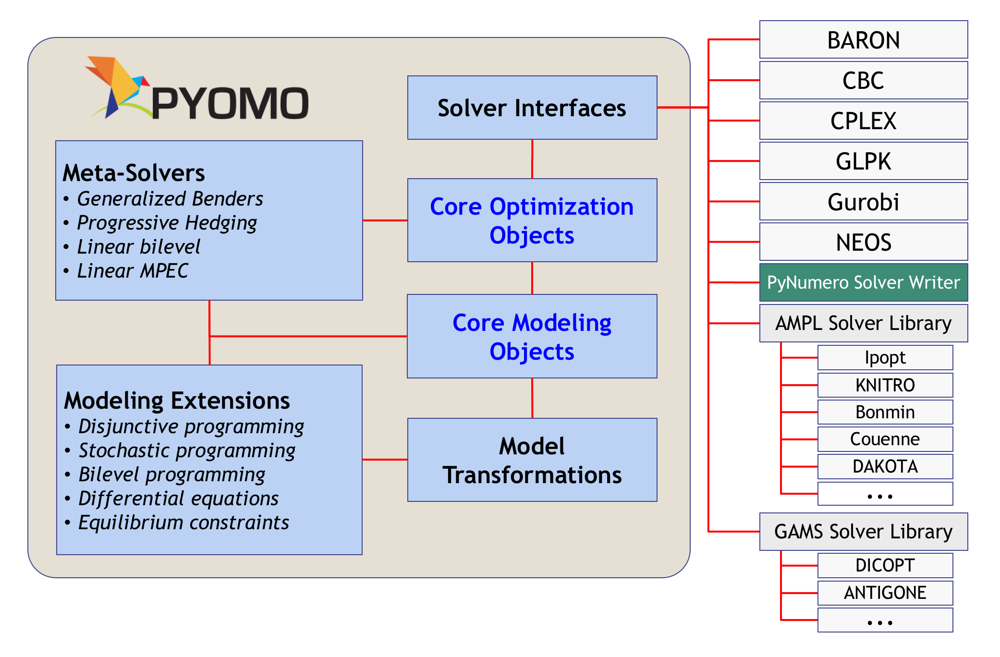

Modeling Language
=================

Optimization problems of complex systems are frequently encountered in
applied mathematics and engineering applications. Finding an optimal
solution for such problems can be challenging for a number of
reasons. First, complex optimization problems are usually large-scale
problems involving integer and continuous variables and linear and
nonlinear expressions. These complexities not only complicate the
solution but also the construction of the optimization formulation
itself. Fortunately, the introduction of algebraic modeling languages
(AMLs) has allowed for the rapid creation of complex optimization
problems by reducing the burden of model development. This eases the
construction of complicated optimization problems, and also makes it
easier to construct intractably large optimization formulations (in a
flexible, consistent manner).

PyNumero builds upon the algebraic modeling language `Pyomo
<https://pyomo.readthedocs.io/en/latest/>`_ and allows optimization
practitioners to build and solve models in Python; providing a
unified modeling and solution platform.

.. _fig-example1:

The idea is to provide a framework for Pyomo users to write taylored
algorithms for solving their problems instead of solving them with
off-the-shelf optimization solvers. Many real-world models require
specialized solution approaches that exploit knowledge of the problem
within the solution approach. Decomposition-based algorithms are one
such approach for solving these challenging problems. By combining
PyNumero with Pyomo, users can directly interrogate Pyomo model features
while writing their solution algorithm in Python.

The proposed workflow to solve an optimization problem with PyNumero
consists of first writing an optimization model in Pyomo, then
translating the model into an NLP representation that efficiently
performs the function and derivative evaluations needed by the solution
algorithm. The NLP representation is implemented in Python and uses
Numpy and Scipy together with the AMPL solver library (for automatic
differentiation). 

In the next section we explain how to transform a Pyomo model into a
PyNumero NLP.
